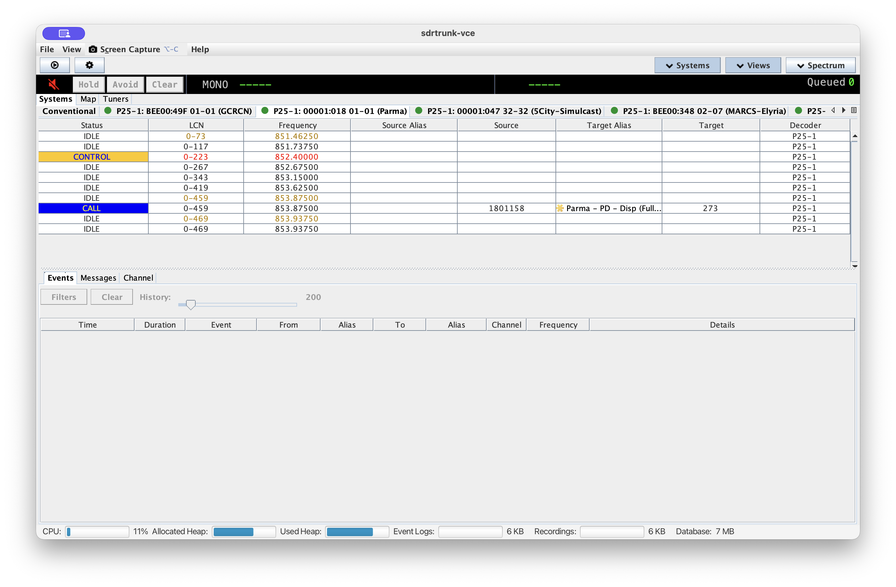
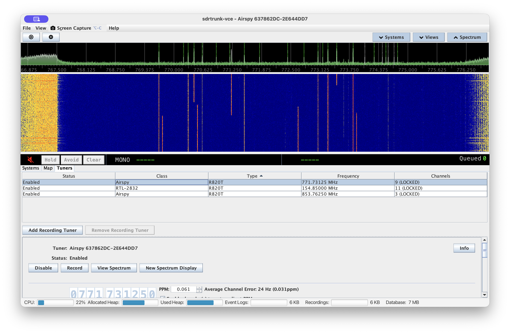
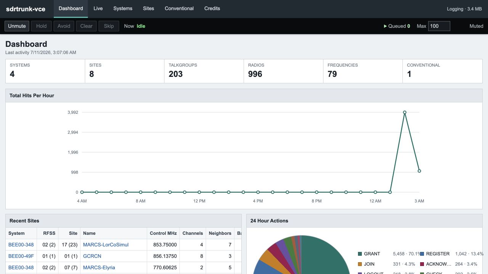
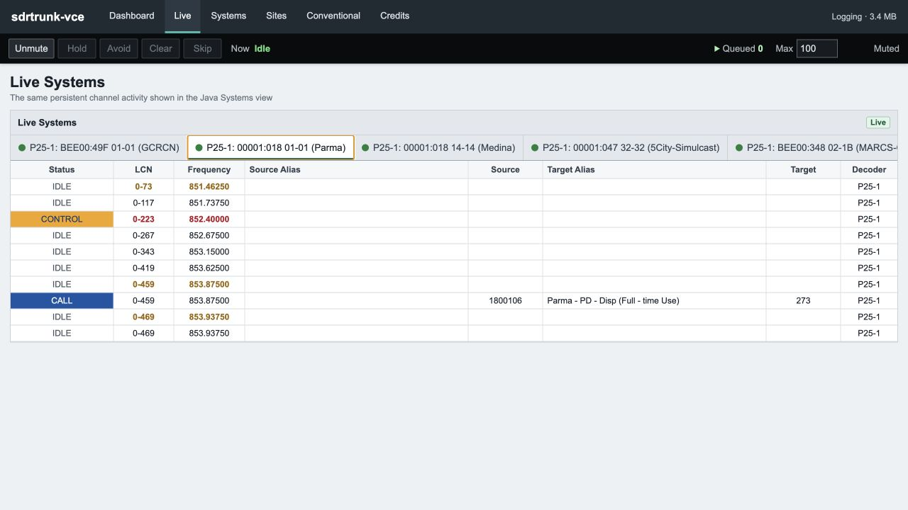
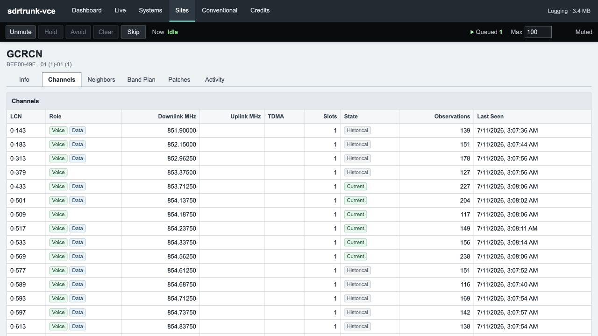

# sdrtrunk-vce

`sdrtrunk-vce` is an operator-focused distribution of
[sdrtrunk](https://github.com/DSheirer/sdrtrunk). It keeps the familiar SDR receiver, decoder, recording, and streaming
workflow while adding a stable system activity workspace, an embedded web console, long-term SQLite statistics,
portable storage, expanded playback controls, and substantial DSP and runtime optimization work.

This project is currently an **alpha release**. Back up important receiver data before testing a new build.

## Highlights

1. **Systems-based activity screen**

   The old Now Playing list is replaced with stable tabs for conventional channels and individual trunked sites.
   Frequencies remain in fixed rows instead of constantly appearing, disappearing, and moving around.

2. **Built-in web interface**

   SDRTrunk can host its own website without Apache, PHP, or XAMPP. From a browser, you can inspect systems, sites,
   channels, talkgroups, radios, affiliations, neighbors, band plans, patches, and activity.

3. **Browser-based scanner audio**

   The website has an independent scanner-style audio player. Calls automatically enter a queue and play in order,
   with browser-local mute, hold, avoid, clear, skip, and queue-limit controls.

4. **Portable SQLite configuration**

   Channels, aliases, streaming settings, tuner settings, preferences, and statistics stay inside the installation.
   Extracted copies are self-contained and do not overwrite another SDRTrunk installation.

5. **Automatic XML upgrade**

   On first launch, the application can locate an older SDRTrunk XML playlist and import it into the portable SQLite
   database. The original XML remains unchanged.

6. **Long-term radio statistics**

   Optional SQLite logging tracks talkgroups, radios, affiliations, frequencies, sites, patches, band plans, and
   activity counts. It supports compact summaries or detailed history with configurable retention.

7. **More reliable P25 site information**

   P25 system facts are learned quickly at startup and then require repeated confirmation before later changes are
   accepted. This helps prevent bad decodes from creating bogus frequencies, neighbors, controls, or identities.

8. **Clear conventional and trunked separation**

   P25 Conventional is a dedicated channel type. It cannot accidentally appear as a trunked system or feed trunked-site
   metadata.

9. **Improved local audio playback**

   Desktop playback includes Hold, Avoid, Clear, persistent mute, a queue counter, and a configurable backlog. Cleaner
   call ownership also reduces dropped, duplicated, and stuck calls.

10. **Major performance improvements**

    Frequently used DSP buffers are reused, short-lived traffic channels share worker threads, and frequency correction
    uses one timer per tuner. These changes reduce memory allocation, garbage collection, and thread overhead.

11. **Stable control-channel learning**

    SDRTrunk can automatically learn announced control channels, while later discoveries must pass stabilization checks.
    This reduces false frequencies caused by occasional decoding errors.

12. **Self-contained releases**

    Windows, macOS, and Linux packages include Java. Users do not need a separate Java installation, and website files
    can be edited without recompiling the application.

## Relationship To Mainline

The common ancestor with official sdrtrunk is commit `a0533156` from February 19, 2026. The comparison in this document
uses official mainline commit `75fa495c` from July 9, 2026. Current mainline NXDN support and its redesigned tuner/channel
frequency correction were integrated into this branch, then adapted to the VCE architecture.

This is not a theme or a small patch set. Several mainline subsystems have been replaced, especially configuration
storage, Now Playing, audio call ownership, and the operator-facing data model. Small parser corrections and mechanical
code cleanup are summarized by area instead of listing every changed source file.

| Area | Official sdrtrunk | sdrtrunk-vce |
| --- | --- | --- |
| Live activity | Flat Now Playing presentation | Stable `Systems` workspace with Conventional and per-site tabs |
| Browser access | No embedded operator website | Embedded read-only web console with live updates and scanner-style audio |
| Long-term statistics | Event logs and recordings | Compact SQLite summaries with optional detailed history and retention |
| Configuration | Playlist XML and several separate preference stores | One portable SQLite database with first-launch XML import |
| Playback | Standard local playback | Queue controls, Hold, Avoid, Clear, persistent mute, and queue limits |
| P25 site facts | Decoder state displayed directly | Shared stabilized site profile used by UI, history, learning, and uploads |
| P25 conventional | Shares the general P25 configuration path | Dedicated P25 Conventional decoder and editor |
| Layout | Fixed main application sections | Systems, lower views, and spectrum can be removed from the active UI |
| Packaging | Standard project distributions | Self-contained portable packages with a bundled Java 25 runtime |

## Screenshots

### Desktop Application

<table>
  <tr>
    <td width="50%"></td>
    <td width="50%"></td>
  </tr>
  <tr>
    <td align="center"><strong>Systems activity workspace</strong></td>
    <td align="center"><strong>Tuners, spectrum, and waterfall</strong></td>
  </tr>
</table>

### Web Console



<table>
  <tr>
    <td width="50%"></td>
    <td width="50%"></td>
  </tr>
  <tr>
    <td align="center"><strong>Live Systems view</strong></td>
    <td align="center"><strong>Site channel history</strong></td>
  </tr>
</table>

## Feature Differences

### Systems Activity Workspace

- Renames Now Playing to **Systems** and replaces its flat table with:
  - one `Conventional` tab for started non-trunked channels
  - one session tab for each started trunked site configuration
- Keeps discovered traffic rows in stable frequency order so calls do not constantly move the table.
- Uses the columns `Status`, `LCN`, `Frequency`, `Source Alias`, `Source`, `Target Alias`, `Target`, and `Decoder`.
- Displays Phase 2 timeslots as separate rows and uses the same `band-channel` LCN format throughout the application.
- Colors both LCN and frequency for current and alternate control channels.
- Shows a live control-status indicator on each site tab. Stale or stopped tabs can be closed without stopping the
  configured channel.
- Maintains one selected row across all site tables and outlines it without hiding status colors.
- Sends the exact selected frequency to the lower views. It does not silently substitute a parent control channel,
  another traffic channel, or the last active system.
- Keeps Events and Messages history until the configured history limit is reached.
- Uses control-channel grants for activity status and an adjustable 100-15,000 ms grant age-out, defaulting to 1,000 ms.
- Can clear idle-row call details or retain the last source and target, according to user preference.
- Synchronizes column widths across every Systems table and restores them at the next launch.
- Provides a **Reset Table Column Widths** command in the View menu.

### Resource-Aware Views

- The Systems workspace can be hidden completely. Its activity feed and associated UI work stop while hidden.
- Events, Messages, and Channel views use a main-window expand/collapse control. Collapsing them detaches listeners,
  disposes their panels, clears selection, and stops their spectrum work.
- Spectrum and waterfall use a matching expand/collapse control. Removing them detaches the display and stops its DFT
  processing; selecting **View Spectrum** from a tuner restores the section automatically.
- Window size, position, maximized state, split-pane positions, and section visibility persist across launches.
- Playlist Editor and User Preferences have toolbar shortcuts.
- The status bar reports Java process CPU use, allocated and used heap, disk usage, and SQLite database size.

### Embedded Web Console

- Runs a small Java web server with no Apache, PHP, or XAMPP dependency.
- Is disabled by default and can be started, stopped, and configured under **Preferences > Stats & Web > Web Server**.
- Can bind to localhost only or allow access from a trusted LAN or private overlay network.
- Serves editable files from the external `stats-web` folder. HTML, CSS, and JavaScript can be changed without
  recompiling SDRTrunk.
- Provides top-level Dashboard, Systems, Sites, and Conventional views.
- Provides scoped drilldowns for:
  - system information, sites, talkgroups, and radios
  - site information, channels, neighbors, band plans, patches, and activity
  - talkgroup information, related radios, and activity
  - radio information, related talkgroups, current affiliation, and activity
  - conventional channel information and applicable activity
- Keeps every displayed talkgroup and radio ID linked to its scoped detail view so investigation paths do not dead-end.
- Includes table-only deep links suitable for embedding a site Info, Channels, Neighbors, Band Plan, or Patches view.
- Uses bounded server-sent event feeds for live Systems state, activity, and completed calls.
- Keeps live table rows stable instead of rebuilding and reordering the page on every update.
- Includes dashboard action and hourly-hit charts.

### Independent Browser Scanner

- Keeps a scanner-style audio player in a persistent website header while the user browses other pages.
- Automatically queues newly completed calls; there is no per-call Play button to chase before a row disappears.
- Provides browser-local Mute, Hold, Avoid, Clear, Skip, and maximum-queue controls.
- Uses mono playback and drops the oldest queued browser calls when its bounded queue is full.
- Streams MP3 bytes from dedicated call URLs rather than embedding audio in JSON.
- Does not change desktop mute, hold, avoid, output channel, or queue settings.
- Keeps call text synchronized with the audio item being played rather than the newest call received.

### Desktop Audio And Call Handling

- Replaces shared, reference-counted audio segments with immutable call events and a single serialized call coordinator.
- Separates producer-side call assembly from completed-call playback, recording, and streaming consumers.
- Adds local **Hold**, **Avoid**, and **Clear** controls:
  - Hold follows one target at a time and removes unrelated queued playback.
  - Avoid is temporary for the current run.
  - Clear removes all temporary avoids.
  - These controls affect local playback only, not recordings or streaming outputs.
- Displays the current number of queued calls in the playback row.
- Adds a configurable maximum playback backlog. Newer calls are retained when the queue limit is reached.
- Persists global mute state and avoids running the local playback path while muted.
- Corrects several call lifecycle races that could drop completed audio, reuse a busy output, or end a call during a
  normal inter-burst pause.

### SQLite Stats Server

- Adds optional P25-focused activity logging and conventional summaries to the portable SQLite database.
- Logging is disabled by default and is independent from the embedded web server.
- Offers two storage modes:
  - compact lifetime and hourly summaries only
  - summaries plus detailed event history
- Uses a bounded in-memory queue and batched transactions so decoder and audio threads never wait for database writes.
- Drops the oldest pending statistics records if that queue fills.
- Keeps grant-based hit totals separate from action-specific counts.
- Tracks system-scoped talkgroups, radios, radio/talkgroup relationships, current radio affiliations, site frequency
  activity, and hourly buckets.
- Tracks stable site snapshots, channels, frequency bands, neighbors, and patch membership by site GUID.
- Stores latest talker aliases on system-scoped radio summaries.
- Supports configurable detailed-history retention and periodic cleanup.
- Provides **Run Maintenance**, **Shrink Database**, **Check Database**, and **Reset Lifetime Stats** controls.
- Uses compact numeric fields and targeted indexes for multi-gigabyte databases and browser drilldown queries.

### P25 Site And Channel Behavior

- Adds a dedicated **P25 Conventional** decoder choice. Conventional channels are classified before startup and cannot
  drift into trunked UI or metadata behavior.
- Adds an editable, automatically generated Site GUID to each configured standard channel. Temporary traffic channels
  inherit that identity from their parent.
- Builds one promoted site profile from control-channel processing. Temporary voice channels do not alter site facts.
- Uses a shared stabilization policy:
  - first valid facts promote immediately during a 60-second discovery window
  - later static changes require three observations across 60 seconds
  - current-control changes use a faster two-observation, 10-second rule
- Stabilizes WACN, System ID, NAC, RFSS, Site ID, current and alternate controls, channels, band plans, neighbors, and
  data-channel facts before normal consumers see them.
- Adds **Learn announced control channels** to P25 trunked channel editors.
- Sends only promoted current and alternate controls to the learner, reducing late-session false additions.
- Validates P25 channel descriptors and frequency-band definitions before resolving them into displayed frequencies.
- Rejects impossible channel numbers, references to missing band plans, conflicting band definitions, and implausible RF
  ranges before they reach tuner allocation or site state.
- Uses downlink LCNs directly and does not require an uplink descriptor merely to display a valid channel.
- Adds a P25 Phase 1 squeak guard for malformed short audio bursts.

### Decoder And DSP Improvements

- Retains the optimized W6BAZ/bazineta DSP base while removing its unrelated experimental tuner integration.
- Reuses hot-path FFT, spectrum, carrier-offset, and polyphase-channelizer buffers instead of allocating new primitive
  arrays for each frame.
- Uses pooled handoff objects across asynchronous channelizer output processing.
- Shares channel dispatcher workers instead of creating a scheduled executor for every short-lived traffic channel.
- Moves frequency-correction ticking to the tuner level so one timer serves all child channels.
- Keeps channel-specific correction estimates while preventing correction timers from scaling with active-channel count.
- Uses midpoint-aware tuner centering and optional frequency envelopes for better multi-frequency passband placement.
- Adds an NBFM post-processing chain with de-emphasis, high-pass, low-pass, voice enhancement, bass boost, and gain.
- Uses unquantized symbol-phase Viterbi decoding for P25 Phase 1 trellis-coded control and packet data.
- Adds semantic validation after error correction to reject structurally valid but nonsensical P25 messages.
- Tightens Phase 2 fragment acquisition and sync plausibility checks.
- Removes a redundant gain stage ahead of the Phase 2 phase demodulator and uses adaptive loop bandwidth after lock.
- Uses sample-rate-specific Phase 2 filter caching.
- Falls back to scalar complex mixing when SIMD calibration has not yet been performed.
- Limits the packaged JVM heap to 2 GB by default and uses compact object headers on Java 25.

### Completed-Call And Site Upload Provider

- Adds a RadioResolve-compatible provider to the normal Streaming editor instead of a separate node application.
- Supports `Calls + Metadata` and `Metadata Only` modes.
- Adds server URL, API credential, node name, validated timezone, maximum recording age, and concurrent-upload settings.
- Uploads completed MP3 calls with source, target, frequency, logical channel, timing, labels, talker alias, node, and
  site GUID context when those values are available.
- Creates the Site GUID when a channel is saved, so call uploads do not have to wait for a complete decoded site profile.
- Retries temporary network and server failures until the configured recording age is reached.
- Keeps a bounded number of concurrent HTTP uploads and streams files from disk instead of loading each whole MP3 into
  heap memory.
- Publishes stabilized site snapshots and repeats unchanged ready snapshots every 30 seconds while the control channel is
  actively decoded.

### Portable Configuration And Packaging

- Replaces playlist XML as the active configuration store with SQLite tables for channels, aliases, streams, channel
  maps, icons, preferences, UI settings, and tuner settings.
- On first launch, detects a normal SDRTrunk XML playlist and offers **Upgrade**, **Start Fresh**, or **Browse**.
- Reads the old XML without modifying it and atomically installs the new database only after creation and validation
  succeed.
- Stores Java preferences in SQLite instead of the operating-system Java preference store.
- Removes the separate `SDRTrunk.properties` and `tuner_configuration.json` writers.
- Keeps every extracted installation self-contained:
  - Windows and Linux: `<install>/data`
  - macOS: `sdrtrunk-vce-data` beside the application bundle
- Keeps logs, recordings, event logs, screenshots, streaming files, JMBE, and application data under that portable data
  root.
- Validates existing schemas at startup but does not alter or upgrade them. Version changes use explicit external,
  one-time maintenance tools.
- Builds self-contained Windows, Linux, and macOS packages for x86-64 and ARM64 with a curated Java 25 runtime.
- Excludes development test frameworks from release packages.

## Intentional Mainline Changes And Removals

- The flat Now Playing view is replaced by Systems.
- The main-window Playlist Editor tab is removed; Playlist Editor remains available from the toolbar and menu.
- The old Details and Activity Summary panels are removed. Current activity is shown through Systems, Events, Messages,
  Channel, and the embedded website.
- Shoutcast v2/Ultravox streaming support is removed. Other retained streaming providers continue to use the normal
  Streaming editor.
- The legacy XML playlist manager, playlist updater, playlist preference, system-properties writer, and tuner JSON writer
  are removed from runtime operation.
- Legacy diagnostic monitors and temporary network/file debug feeds are not included in release behavior.
- Schema repair and schema migration are not performed from normal application services.

## Installation And First Launch

1. Extract the package to a writable folder. Do not merge it into a stock SDRTrunk installation.
2. Start `bin/sdrtrunk-vce` on macOS/Linux or `bin\sdrtrunk-vce.bat` on Windows.
3. If no portable database exists, choose an automatically discovered XML playlist, browse to one, or start fresh.
4. Configure JMBE through **Preferences > Decoder > JMBE Audio Library** when digital voice conversion is required.
5. Configure Stats Server and Web Server separately under **Preferences > Stats & Web**.

The release includes Java. A separate Java installation is not required.

## Building From Source

Java 25 is required for development builds.

```bash
./gradlew test
./gradlew runtimeZipCurrent
```

Cross-platform package tasks:

```bash
./gradlew --no-configuration-cache runtimeZipWindows
./gradlew --no-configuration-cache runtimeZipOthers
```

Build output is written under `build/image`.

## Changelog

### 0.6.2-alpha-1 - 2026-07-11

#### Added

- Systems activity workspace with Conventional and per-site tabs.
- Embedded web console, linked drilldowns, live state feeds, and browser-local scanner audio.
- SQLite lifetime/hourly statistics, optional detailed history, retention, and database maintenance controls.
- Dedicated P25 Conventional configuration.
- Site GUID identity, promoted P25 site facts, and announced-control learning.
- Local playback Hold, Avoid, Clear, queue counter, persistent mute, and bounded backlog.
- Additional completed-call and stabilized-site upload provider.
- CPU, heap, disk, and database-size status indicators.
- Current mainline NXDN decoder and tuner/channel frequency-correction design.

#### Changed

- Replaced mutable shared audio segments with immutable call events and one call coordinator.
- Replaced XML runtime configuration with portable SQLite storage and first-launch import.
- Replaced independent properties and tuner writers with one keyed SQLite settings store.
- Reworked P25 activity status to use control-channel grants and event-driven expiry.
- Unified P25 site fact stabilization across UI, statistics, learning, and upload consumers.
- Reduced FFT, spectrum, channelizer, decoder, and dispatcher allocation/thread overhead.
- Consolidated packaged runtime modules and JVM arguments across platforms.
- Decoupled browser playback state from desktop playback state.

#### Removed

- Flat Now Playing table and main-window Playlist Editor tab.
- Details/Activity Summary panel.
- Shoutcast v2/Ultravox provider.
- Runtime XML playlist manager and automatic in-process schema upgrades.
- Separate system-properties and tuner-configuration files.
- Temporary debug servers, diagnostic hooks, and release test-library dependencies.

### Development Milestones

- **2026-07-10:** Portable alpha packaging, embedded web scanner rewrite, editable web assets, and product identity cleanup.
- **2026-07-08:** XML-to-SQLite importer, Stats schema cleanup, NXDN integration, and tuner correction consolidation.
- **2026-07-07:** Expanded SQLite statistics and website drilldowns, portable startup work, and major UI cleanup.
- **2026-06-27:** Control-grant activity ownership, configurable age-out, site-fact stabilization, and upload separation.
- **2026-06-24:** Initial Systems activity tabs, scalar mixer fallback, and P25 malformed-audio guard.

## Credits And License

SDRTrunk was created by Dennis Sheirer. `sdrtrunk-vce` includes work from the official SDRTrunk community and optimization
and platform work from the W6BAZ/bazineta experimental fork, followed by the VCE-specific changes documented above.

- [Official SDRTrunk project](https://github.com/DSheirer/sdrtrunk)
- [Official SDRTrunk wiki](https://github.com/DSheirer/sdrtrunk/wiki)
- [W6BAZ/bazineta fork](https://github.com/bazineta/sdrtrunk)

This project is distributed under the GNU General Public License version 3. See [LICENSE](LICENSE) and [NOTICE](NOTICE).
It is an independent modified distribution and is not an official SDRTrunk release or support channel.
