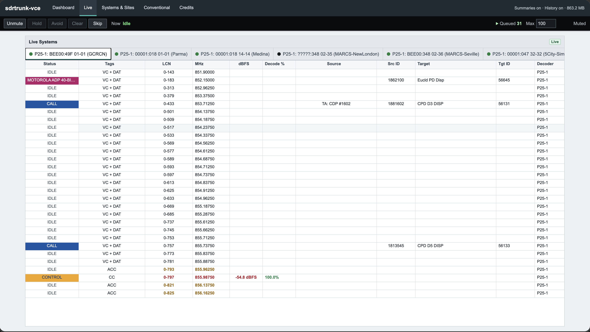
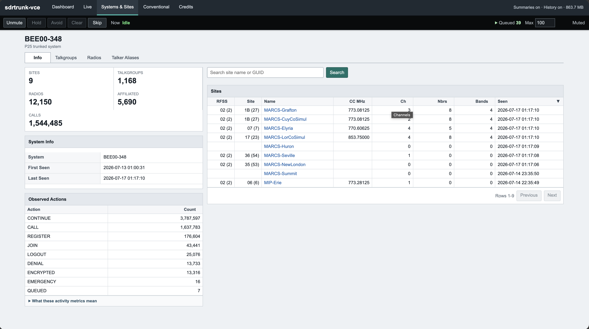
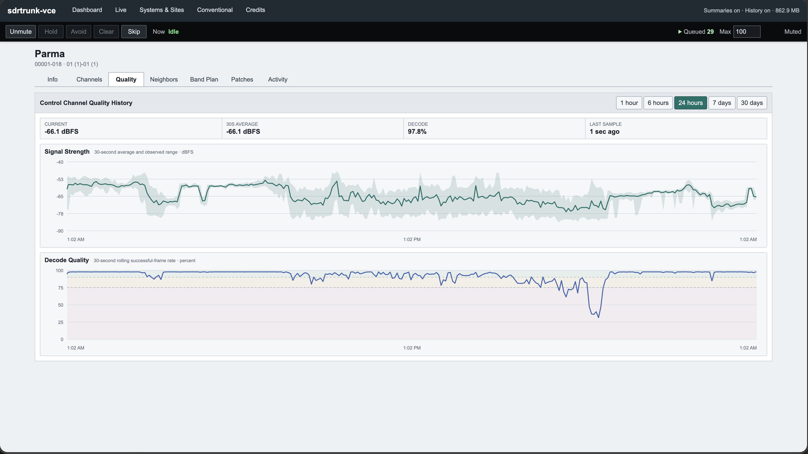
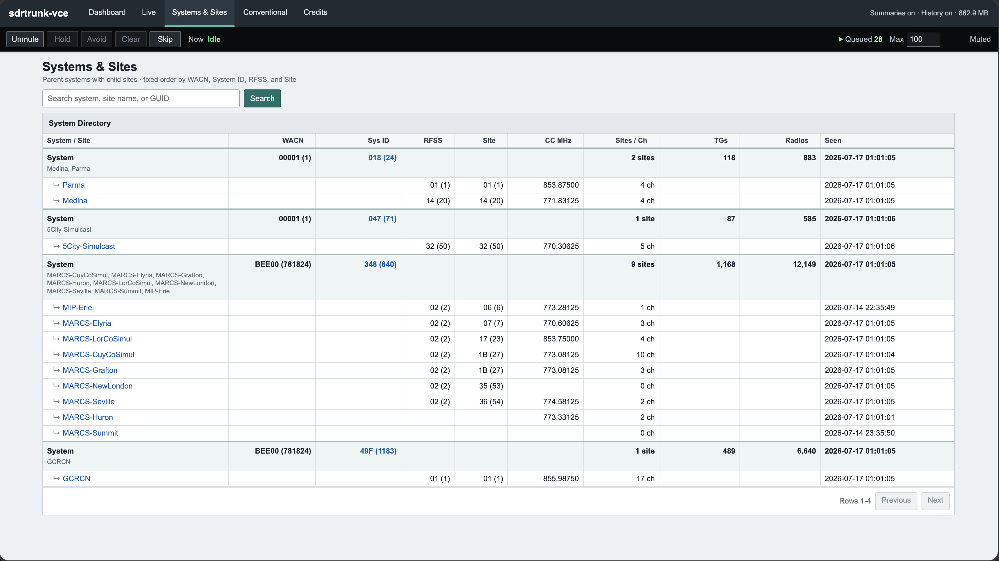
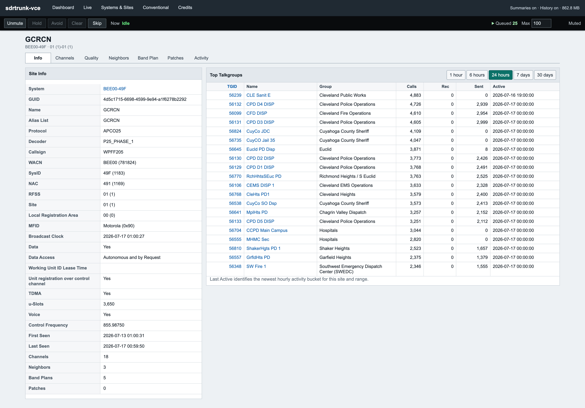
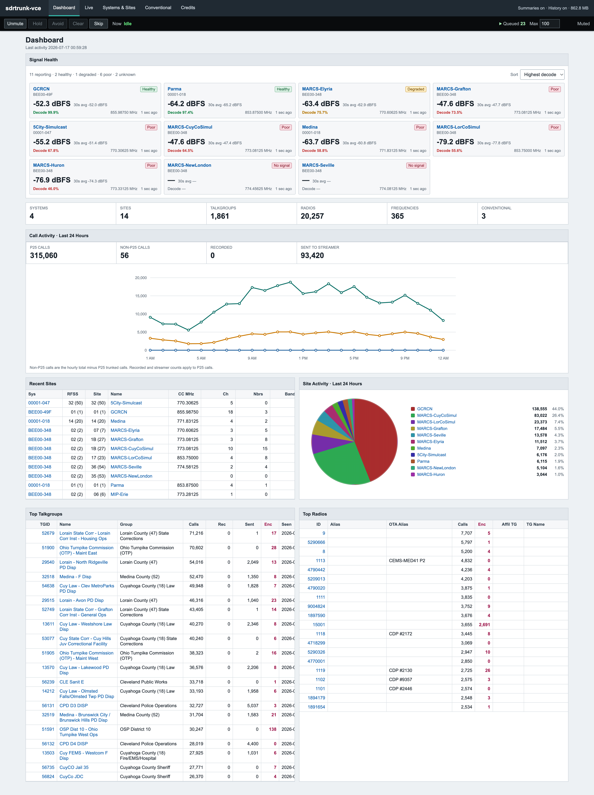
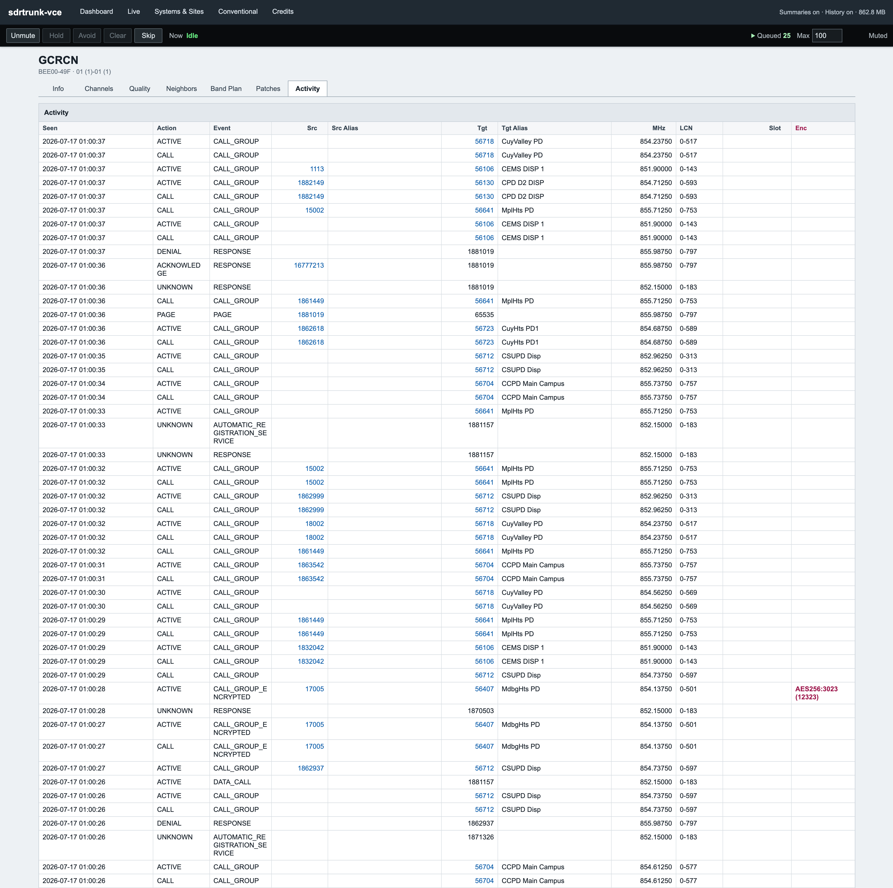

# sdrtrunk-vce

`sdrtrunk-vce` is an independent, enhanced version of
[SDRTrunk](https://github.com/DSheirer/sdrtrunk). It keeps the familiar receiver, decoder, recording, streaming, and
Java desktop features while adding a better activity screen, a built-in website, portable storage, more playback
controls, long-term statistics, and performance improvements.

This project has two release channels. Back up your receiver data before installing or upgrading.

- [Download Alpha 12](https://github.com/tylerwatt12/sdrtrunk-vce/releases/tag/v0.6.2-alpha-12): the more stable,
  deliberately maintained line. Alphas receive selected fixes after review and testing and can intentionally omit
  newer Nightly features.
- [Download the current Nightly](https://github.com/tylerwatt12/sdrtrunk-vce/releases/tag/nightly): the rolling build
  from `main`, with the newest features and fixes and a higher chance of change or regression.
- [Sponsor development](https://github.com/sponsors/tylerwatt12)
- [Report a problem or request a feature](https://github.com/tylerwatt12/sdrtrunk-vce/issues)

> **More features, less overhead.**
>
> In the project's same-receiver test, VCE used **8.5% less CPU** and had **25% fewer Java cleanup pauses** than the
> latest tested official SDRTrunk build. Results will vary depending on your computer, tuners, channels, and enabled
> features.

## Highlights

- **Stable activity screen:** Systems replaces Now Playing with one Conventional tab and stable tabs for each trunked
  site. Frequencies stay in place instead of constantly moving around.
- **Built-in webserver and scanner:** View live systems, sites, channels, talkgroups, radios, activity, and statistics
  from a browser. Browser audio has its own Mute, Hold, Avoid, Clear, Skip, and queue controls.
- **Portable setup:** Each VCE installation keeps its own database, settings, tuners, JMBE library, logs, recordings,
  statistics, and web files. It does not rely on the sdrtrunk in the userprofile, so you can rest assured it will not overwrite files from previous versions of sdrtrunk
- **Safe importing and upgrades:** VCE allows you to import an existing SDRTrunk XML playlist, or migrate to a new version from a previous VCE database with the built-in Application Migrator.
- **Clear channel types:** Conventional P25, DMR, and NXDN are kept separate from trunked systems.
- **Improved listening:** Desktop audio adds Hold, Avoid, Clear, saved mute state, a queue counter, and a queue limit.

## What’s New in Alpha 12

Alpha 12 is a focused repair for Windows SDRplay support and release packaging.

- **Windows packages again include the SDRplay API search path** used by every supported RSP model.
- **The SDRplay fallback loader now resolves the actual `sdrplay_api.dll` filename** in the standard 64-bit API folder.
- **Both Windows processor packages are checked before release** for the required launcher settings and Windows UI
  classes.
- **Other tuner implementations, decoders, and the database format are unchanged.**

Read the complete [Alpha 12 What’s New](docs/whats-new-0.6.2-alpha-12.md) before upgrading.

## Screenshots

Click any screenshot to view it at full size.

<p align="center">
  <a href="docs/screenshots/web-live-systems.png"></a>
  <br>
  <strong>Live Systems</strong> — stable channel rows with current calls, signal level, and decode quality.
</p>

<table>
  <tr>
    <td width="50%" valign="top">
      <a href="docs/screenshots/web-system-overview.png"></a>
      <p align="center"><strong>System overview</strong></p>
    </td>
    <td width="50%" valign="top">
      <a href="docs/screenshots/web-control-channel-quality.png"></a>
      <p align="center"><strong>Signal and decode quality</strong></p>
    </td>
  </tr>
  <tr>
    <td width="50%" valign="top">
      <a href="docs/screenshots/web-systems-sites-directory.png"></a>
      <p align="center"><strong>Systems and Sites directory</strong></p>
    </td>
    <td width="50%" valign="top">
      <a href="docs/screenshots/web-site-overview.png"></a>
      <p align="center"><strong>Site overview</strong></p>
    </td>
  </tr>
</table>

<details>
  <summary><strong>More screenshots</strong></summary>
  <br>
  <table>
    <tr>
      <td width="50%" valign="top">
        <a href="docs/screenshots/web-dashboard-overview.png"></a>
        <p align="center"><strong>Operations dashboard</strong></p>
      </td>
      <td width="50%" valign="top">
        <a href="docs/screenshots/web-site-activity.png"></a>
        <p align="center"><strong>Detailed site activity</strong></p>
      </td>
    </tr>
  </table>
</details>

## Which Release Channel Should I Use?

| Channel | Source | Use it for |
| --- | --- | --- |
| **Alpha** | [`release/0.6.2-alpha`](https://github.com/tylerwatt12/sdrtrunk-vce/tree/release/0.6.2-alpha) | Numbered, reviewed builds intended for users who value stability over getting every new feature immediately. |
| **Nightly** | [`main`](https://github.com/tylerwatt12/sdrtrunk-vce/tree/main) | A rolling development build for trying the newest features and fixes. It can change more often and may need additional testing. |

New work lands in Nightly first. A selected fix reaches Alpha only after it is reviewed, tested, and backported to the
Alpha line. The two channels therefore have intentionally different feature sets.

## Coming From Regular SDRTrunk?

Your existing SDRTrunk installation and XML files are safe. VCE only **reads** XML during import. It does not overwrite,
move, rename, delete, or write changes back to the XML.

The easiest way to switch is:

1. Leave regular SDRTrunk where it is.
2. Extract VCE.
3. Start VCE and choose **Import Older XML**.
4. Review the imported channels and file locations.
5. Keep the old installation until VCE has been tested.

VCE normally finds:

```text
${user.home}/SDRTrunk/playlist/default.xml
${user.home}/SDRTrunk/playlist/playlist_v2.xml
```

You can also choose another XML file. First-launch import creates a new SQLite configuration. To add another playlist
later, use **File > Import Legacy Playlist XML**. VCE previews the supported contents, keeps existing configuration,
renames imported name conflicts, and creates a timestamped database backup before applying the import. Your original
XML remains unchanged and regular SDRTrunk can continue using it.

To replace the active profile from a supported older database after setup, use **File > Import SQLite Database**.
VCE shows the migration plan and an explicit replacement warning, retains the current database as a safety backup,
migrates only a staged copy of the selected file, validates it, and restarts. This imports only SQLite contents; it
does not copy files beside the selected database or remap stored portable paths. A failed replacement does not
restart automatically when the final active-database state cannot be confirmed.

After importing:

- Check that P25 and DMR channels have the correct Conventional or Trunked type.
- Check tuner assignments and auto-start channels.
- Set up JMBE under **Preferences > Decoder > JMBE Audio Library** if needed.
- Check recording, event-log, screenshot, and streaming folders.
- Back up the new VCE data folder.

## Updating VCE

VCE checks for a newer build in its own release channel when the desktop app starts. You can also use
**Help > Check for Updates**. Alpha builds check only for newer Alphas, and Nightly builds check only for newer
Nightlies.

The update check does **not** download, install, replace files, change the database, restart VCE, or switch channels.
You always choose when to install an update.

Recommended update steps:

1. Close the old VCE version.
2. Back up its complete data folder.
3. Extract the new version into a new empty folder.
4. Start it and choose **Migrate Previous Data**.
5. Select the old app or data folder if VCE does not find it automatically.
6. Check your channels, tuners, JMBE library, file locations, web settings, and auto-start behavior.

The Application Migrator copies the setup, creates a safety backup, updates a separate copy of the database, and checks
it before the new version starts. The old installation is left unchanged, making it easy to go back.

Existing logs, recordings, screenshots, event logs, and streaming output are not copied into the new installation.
Check the saved folder locations before deleting an old version.

Follow the target release's migration instructions. Database changes move forward: a newer Nightly may use a database
format that the current Alpha does not know, so do not copy a newer database into an older build. Keep separate data
folders when testing both channels, and never run both builds against the same data folder.

## Where VCE Stores Data

- Windows and Linux: `<install>/data`
- macOS: `<app-name>-data` beside the `.app`
- Development builds: `<working-directory>/data`

This data folder contains the active database, settings, tuner setup, vault, JMBE library, optional modules, logs,
recordings, screenshots, event logs, streaming files, statistics, and editable website files.

VCE does not store its active setup in `~/SDRTrunk`, AppData, the registry, or your operating system's Java preferences.
The old `~/SDRTrunk` folder is used only as a possible source for XML import.

For more detail, see [Portable Startup And Storage](docs/portable-startup-and-storage.md).

## Supported And Removed Features

These older or experimental features are not included:

- Local alias actions and the Actions editor
- LTR Standard, LTR-Net, Passport, and MPT-1327 decoders
- Funcube Dongle Pro/Pro+ tuners
- Legacy named Channel Maps formerly used by MPT-1327; decoder-embedded DMR and NXDN channel maps remain supported
- Heterodyne channelization
- Sound-card capture sources
- Shoutcast v2/Ultravox streaming

## Installation

1. Choose a numbered Alpha or the rolling Nightly from [GitHub Releases](https://github.com/tylerwatt12/sdrtrunk-vce/releases).
2. Extract it into a new writable folder.
3. Start `sdrtrunk-vce.app` on macOS, `bin/sdrtrunk-vce` on Linux, or `bin\sdrtrunk-vce.bat` on Windows.
4. Import XML, migrate a previous VCE setup, or start fresh.
5. Review the imported channels and file locations before enabling auto-start.

Java is included in release packages. You do not need to install it separately.

## Building From Source

Development builds require Java 25.

```bash
./gradlew test
./gradlew runtimeZipCurrent
```

Other package tasks:

```bash
./gradlew image
./gradlew macAppZip
./gradlew --no-configuration-cache clean runtimeZipWindows -PjavafxPlatform=win -PprojectVersion=local-dev -PupdateTrack=none -PupdateBuild=0
./gradlew --no-configuration-cache clean runtimeZipOthers -PprojectVersion=local-dev -PupdateTrack=none -PupdateBuild=0
```

Each cross-platform package command starts from a clean build. If you are collecting every platform package, copy
the first command's ZIP files outside `build/image` before running the second command, then restore them afterward.

Build output is written under `build/image`.

## More Information

- [Release notes](https://github.com/tylerwatt12/sdrtrunk-vce/releases)
- [Portable startup and storage](docs/portable-startup-and-storage.md)
- [How talker aliases work](docs/talker-alias-implementation.md)
- [Listening-delay findings](docs/sdrtrunk-latency-findings.md)

## Sponsor Development

If VCE is useful to you, you can
[sponsor development through GitHub Sponsors](https://github.com/sponsors/tylerwatt12).

Sponsorships are optional and are used only to offset the AI-assisted development costs of building and maintaining
this fork, including Codex subscriptions, coding-agent tools, and usage-based AI model/API charges. Unused funds are
saved for the same future development costs.

Sponsorship does not buy software, features, support, priority, early access, or influence over project decisions. VCE
remains free and open-source. Sponsorship supports this independent fork, not the original SDRTrunk project or other
upstream projects.

## Credits And License

SDRTrunk was created by Dennis Sheirer. `sdrtrunk-vce` includes work from the official SDRTrunk community and
optimization and platform work from the W6BAZ/bazineta experimental fork, followed by VCE-specific changes.

- [Official SDRTrunk project](https://github.com/DSheirer/sdrtrunk)
- [Official SDRTrunk wiki](https://github.com/DSheirer/sdrtrunk/wiki)
- [W6BAZ/bazineta fork](https://github.com/bazineta/sdrtrunk)

This project uses the GNU General Public License version 3. See [LICENSE](LICENSE) and [NOTICE](NOTICE). It is an
independent modified distribution and is not an official SDRTrunk release or support channel.
