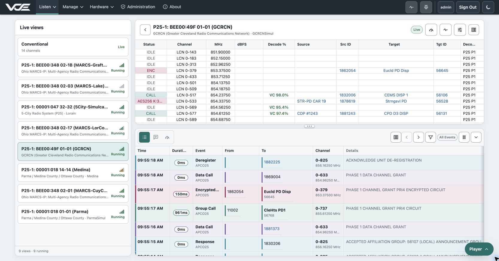
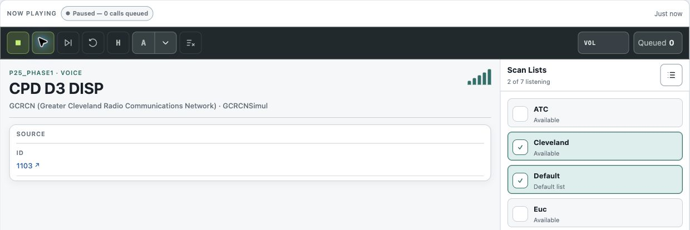
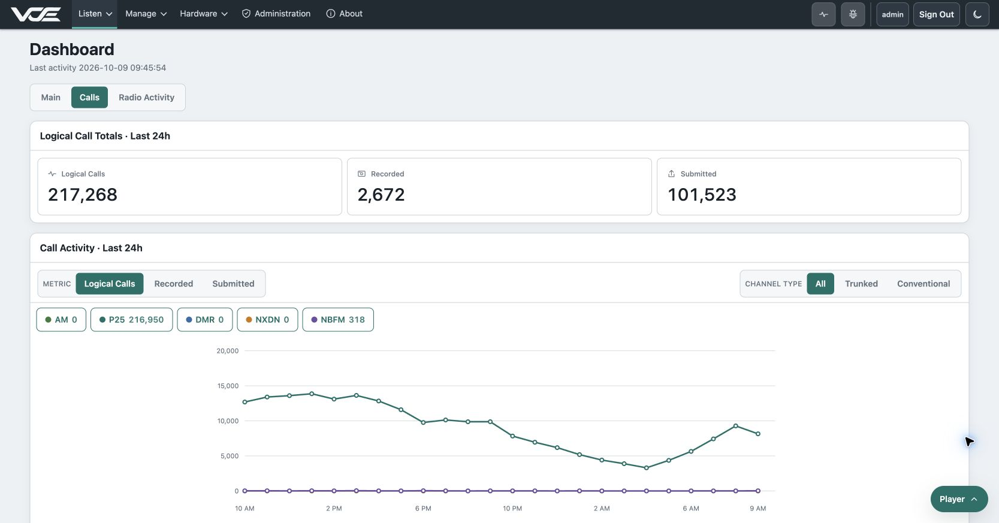
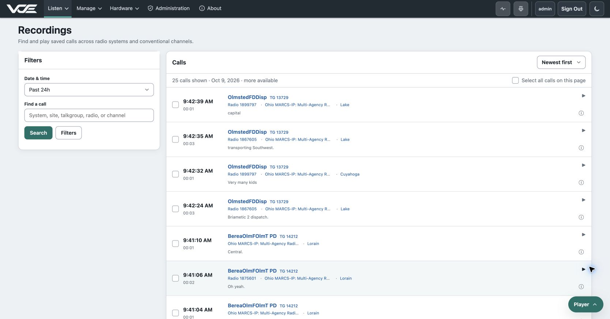
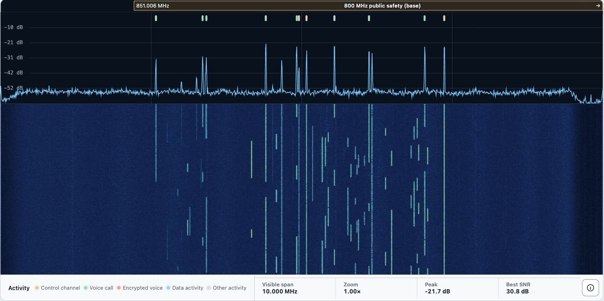
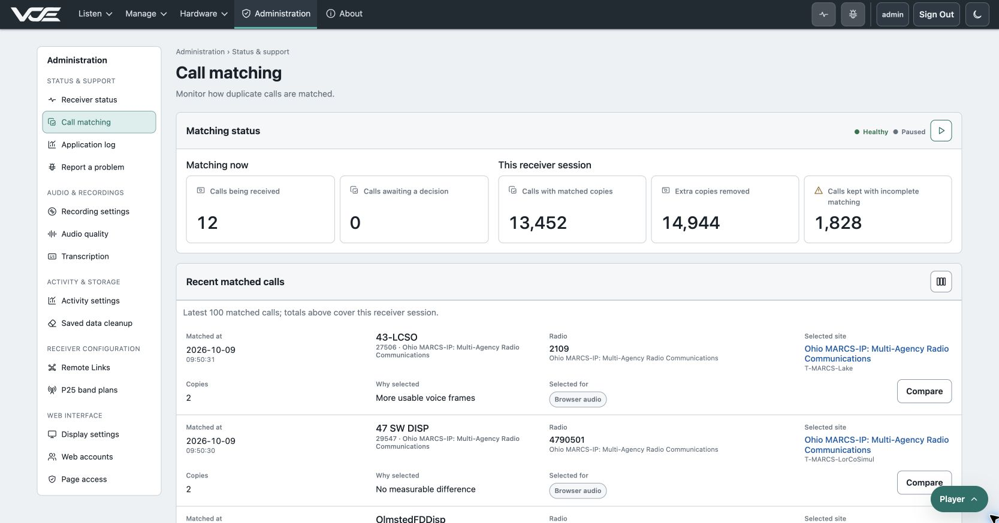
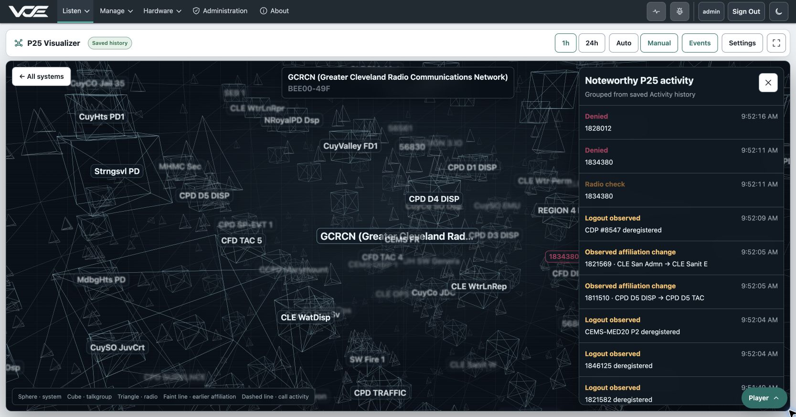

# SDRTrunk VCE

SDRTrunk VCE is an enhanced fork of [sdrtrunk](https://github.com/DSheirer/sdrtrunk) for receiving, listening to,
recording, and streaming radio traffic. It adds a built-in web interface, flexible Scan Lists, searchable recordings,
and detailed activity and signal history, alongside improvements to decoding and receiver reliability.

Run VCE on the computer connected to your SDR, then listen and manage it from a browser on your computer, phone,
or tablet. If you already use sdrtrunk, VCE can import your existing playlist so you can try it with a familiar setup.

**[Download Nightly](https://github.com/tylerwatt12/sdrtrunk-vce/releases/tag/nightly)** ·
[Numbered Alpha releases](https://github.com/tylerwatt12/sdrtrunk-vce/releases?q=alpha) ·
[Support development](https://github.com/sponsors/tylerwatt12) ·
[Report an issue](https://github.com/tylerwatt12/sdrtrunk-vce/issues)



*Screenshots show real activity from a running VCE receiver.*

## Download VCE

VCE is free and open-source, with packages for **Windows, macOS, and Linux** on **Intel/AMD 64-bit and ARM64**.
Java is included in the download.

| Release | Choose it when… | Download |
| --- | --- | --- |
| **Nightly** | You want the features described here and the newest improvements. | [Download Nightly](https://github.com/tylerwatt12/sdrtrunk-vce/releases/tag/nightly) |
| **Numbered Alpha** | You prefer the more conservative release line and its version-specific feature set. | [Browse Alpha releases](https://github.com/tylerwatt12/sdrtrunk-vce/releases?q=alpha) |

Both release lines are pre-release software. **The features and screenshots here describe current Nightly; Alpha
may have fewer features or a different interface.** Read the notes on the release you choose.

On the release page, open **Assets** and choose the ZIP for your operating system and processor. For Nightly, use the
build number identified at the top of the release page to find the current ZIP. Apple Silicon Macs use ARM64; Intel
Macs and most Intel/AMD PCs use the 64-bit x86 package. See the [release-channel guide](docs/release-channels.md) for
more detail.

## What VCE adds

### Listen and manage from your browser

The web interface brings receiver controls and listening together, without needing remote desktop access.

- **Remote management:** Set up channels, tuners, aliases, recordings, and streaming destinations from the website.
- **Scan Lists:** Create listening groups such as Fire, Police, or Transit. Combine aliases from different systems
  and Alias Lists, choose how unmatched talkgroups are handled, and let each listener select one or more lists.
- **Personal playback controls:** Pause, skip, hold, avoid, replay the last call, and manage queued calls.
  Optional call grouping helps keep related calls together when several conversations are waiting.
- **Phone and tablet support:** The interface and player adapt to smaller screens, with light and dark themes.
- **Multiple users:** Give listeners their own accounts and control access to listening, radio activity, and
  administration. Each listener can make their own listening choices.

Browser audio plays completed calls, so it follows reception with a delay. Switching Scan Lists changes what that
listener hears while the receiver continues monitoring its configured channels.

[Read the Scan List and listening guide](docs/browser-listening-and-scan-lists.md).



*Select your Scan Lists and follow calls with the browser's Scanner controls.*

### See what your receiver is hearing

Understand activity across conventional channels and trunked systems, from the calls happening now to trends collected
over time.

- **Live activity:** See active calls and idle channels grouped by system and site, with signal strength and decode
  quality alongside the activity.
- **Dashboards and charts:** Review call counts, recordings, streaming activity, and usage over time for both
  conventional and trunked channels.
- **Searchable activity history:** Explore systems, sites, talkgroups, and radios by name or ID. Open their detail
  pages to follow calls, affiliations, patches, and other observed activity.
- **Signal history:** Compare retained signal-strength and decode-quality measurements to spot changes in reception.
- **Alias activity:** See observed talkgroups that still need names, and compare actual use with your existing aliases
  before cleaning up old or unused entries.
- **Receiver health:** Monitor issues that can interrupt audio or control-channel reception, then open detailed
  signal, symbol, event, and message views to investigate.
- **Radio location map:** View decoded positions and recent trails when received radio traffic includes location data.



### Find and replay recordings

**Managed Recordings** turns saved calls into a library you can browse and play in the website.

- Find calls by time, system, site, talkgroup, or radio, using names and aliases as well as IDs.
- Queue calls for playback and download audio.
- Connect a compatible transcription service to read transcripts and search for words or phrases.
- Set automatic age-based cleanup for managed calls.

Managed Recordings and transcription are optional. Transcription requires a separately configured service.
Classic per-call file recording is also available.



### Set up channels and keep aliases useful

- **Add from the waterfall:** Open **Hardware > Browser Spectrum**, select a frequency, and create a channel from the signal
  you are looking at.
- **Find trunked systems:** Use **Manage > Channels > Find Trunked Systems** to search with an available tuner,
  check supported P25, DMR, and NXDN signals, and add selected channels.
- **RadioReference imports:** Bookmark systems and agencies, import sites and conventional channels, and preview
  talkgroup additions or updates. Updating names and descriptions preserves your local listening, recording,
  streaming, color, and icon choices.
- **Bulk alias tools:** Edit multiple aliases together and use [CSV import and export](docs/alias-import-export.md)
  to maintain your lists.
- **P25 band-plan overrides:** Enter a band plan manually when a system does not broadcast usable channel information,
  with overrides for a system or an individual site.

RadioReference imports require a RadioReference account with access to its data service.



### Stream calls and combine P25 reception from multiple sites

VCE supports external destinations including **Broadcastify, Rdio Scanner, OpenMHz, and RadioResolve**, with streaming
status and activity available in the website.

- **Site-based Broadcastify Calls:** Assign a Broadcastify Calls destination to a trunked site and send eligible calls
  heard on that site. Sites can share an Alias List, so you do not need duplicate lists just to keep site uploads
  separate.
- **Remote P25 Links:** Share P25 feeds between trusted VCE installations. A receiving installation can process local
  and linked feeds together, collecting their activity and statistics in one place.
- **Duplicate-call selection:** When several trunked sites of the same P25 system hear the same call, VCE compares
  the received voice evidence and selects the best-quality copy for listening, recording, and streaming. The
  Call Matching monitor shows which copies were combined and why one was selected.
- **ISSI and roaming identities:** Track a P25 radio's home-system identity separately from the temporary ID it uses
  on another system, keeping radios with similar local numbers distinguishable.



*The Call Matching monitor explains how copies of a call are compared and selected.*

### Explore P25 activity in 3D

**P25 Visualizer** shows systems, talkgroups, and radios in an interactive 3D scene. Each system has its own space,
with radios arranged around their observed talkgroup affiliations. Noteworthy events, such as affiliation changes,
emergencies, denials, pages, and radio checks, draw attention as new history arrives.

Enable detailed P25 activity history to populate the scene. It shows logical relationships rather than geographic locations.
[See how to read the visualizer](docs/network-visualizer.md).



*Explore the relationships between P25 systems, talkgroups, and radios.*

## Get started

You need a supported SDR and any drivers it requires, plus an antenna suitable for the signals you want to receive.

1. **Download and extract VCE** into a new writable folder.
2. **Run the Start VCE launcher:** `Start VCE.bat` on Windows, `Start VCE.command` on macOS, or `Start VCE.sh` on Linux.
3. **Follow setup.** Start fresh, import a mainline sdrtrunk XML playlist, or copy a previous VCE installation.
   Set up your administrator account, web access, and JMBE digital audio library when prompted.
4. **Review channels and tuners.** Check your imported settings or add channels in the website.
5. **Start receiving and listening.** Open the website from the receiver window, choose a Scan List, and press Play.

New setups initially make the website available only on the receiver computer. Choose **Other devices** during setup
if you want access from another device, and configure your network and firewall as needed.

### Coming from mainline sdrtrunk

You can keep your existing installation while trying VCE. Playlist import reads your XML without changing it, and
VCE stores its own setup in a `data` folder beside the extracted application.

A few differences are useful to know:

- **Most receiver management is in the website.** The smaller local window opens it and provides setup, file access,
  and local tools.
- **Scan Lists control browser listening.** Aliases imported with listening enabled join the default Scan List;
  each browser listener can then choose the lists they want.
- **Alias Lists are organized by protocol family:** P25, DMR, NXDN, or analog AM/NBFM.
- **Some older sdrtrunk features are retired.** Check the compatibility list below if your setup depends on them.

<details>
<summary>Features not included in VCE</summary>

- LTR Standard, LTR-Net, Passport, and MPT-1327 decoders
- Funcube Dongle Pro/Pro+ tuners and sound-card capture sources
- Local alias actions and the desktop Actions editor
- Legacy MPT-1327 named Channel Maps; DMR and NXDN channel maps remain supported
- Heterodyne channelization
- Shoutcast v2/Ultravox streaming
- Desktop tuner Spectrum/Waterfall panels and separate spectrum windows; use the web Spectrum tools instead

</details>

## Updating and backing up

Back up your complete `data` folder before an upgrade. Extract the new version into a new folder, run **Start VCE**,
and choose **Copy a previous VCE installation / data folder** in setup. Review the import plan and output folders
before receiving resumes.

The built-in import upgrades a copy of supported settings and leaves the previous installation unchanged.
Existing recordings and logs are not copied. Check their saved folder locations and keep the old installation until
you have checked what you need.

Update checks follow your installed release channel and let you choose when to download and install.
**Do not use a newer version's data with an older build**, including when switching from Nightly to Alpha.

Read the [portable setup and storage guide](docs/portable-startup-and-storage.md) and
[upgrade compatibility guide](docs/database-migration.md) for details.

## Support development

If VCE makes your radio setup more useful, **[support its development through GitHub Sponsors](https://github.com/sponsors/tylerwatt12)**.

Contributions help offset the AI-assisted development costs of this independent fork, including Codex subscriptions,
coding tools, and model/API usage. Unused funds are saved for those future costs. Sponsorship is optional; VCE remains
free and open-source. It does not purchase features, support, priority, early access, or influence over project
decisions, and it supports VCE rather than the original sdrtrunk project.

## Help and more information

- [Documentation guide](docs/README.md)
- [Report a problem or request a feature](https://github.com/tylerwatt12/sdrtrunk-vce/issues)
- [Release notes and downloads](https://github.com/tylerwatt12/sdrtrunk-vce/releases)
- [Browser listening and Scan Lists](docs/browser-listening-and-scan-lists.md)
- [P25 Visualizer](docs/network-visualizer.md)
- [Portable setup, importing, and storage](docs/portable-startup-and-storage.md)
- [Talker aliases](docs/talker-alias-implementation.md)
- [Official sdrtrunk wiki](https://github.com/DSheirer/sdrtrunk/wiki)

<details>
<summary>Building from source</summary>

Development builds require Java 25.

```bash
./gradlew test
./gradlew clean build -PprojectVersion=local-dev -PupdateTrack=none -PupdateBuild=0
```

To build all six operating-system and processor archives under `build/image`:

```bash
./gradlew --no-configuration-cache clean runtimeZipAll -PprojectVersion=local-dev -PupdateTrack=none -PupdateBuild=0
```

Use a non-public version such as `local-dev` for development packages. Target Java runtimes are downloaded, verified,
and cached for later builds.

</details>

## Credits and license

sdrtrunk was created by **Dennis Sheirer**. VCE builds on work from the
[official sdrtrunk community](https://github.com/DSheirer/sdrtrunk) and the
[W6BAZ/bazineta experimental fork](https://github.com/bazineta/sdrtrunk), with additional VCE features and improvements.

VCE is an independent modified distribution, with its own releases and support. It uses the **GNU General Public
License version 3**. See [LICENSE](LICENSE) and [NOTICE](NOTICE).
