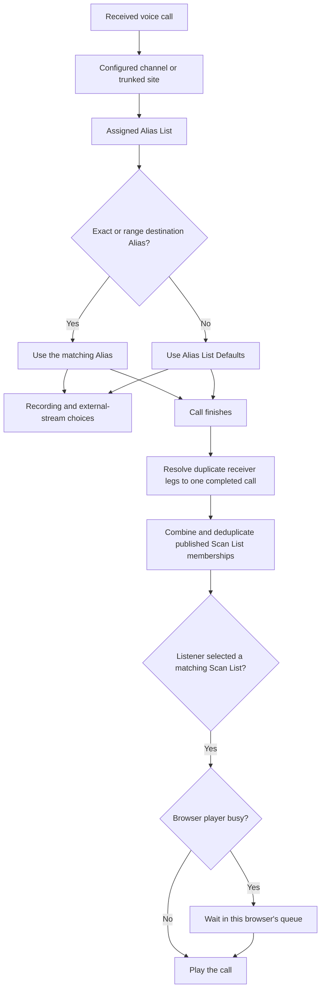

# How Browser Listening and Scan Lists Work

> **Release scope:** This guide describes current `main` and Nightly behavior. Numbered Alpha builds may omit these
> newer browser-listening and Alias features.

`sdrtrunk-vce` receives and decodes calls continuously. Browser listening begins with a completed call: after the
receiver finishes a call, the call is matched to published Scan Lists and offered to browser listeners who selected
one of those lists.

This differs from upstream SDRTrunk, which sends live audio segments to its desktop playback outputs while each call
is still being produced.

## The Short Version

1. A configured channel or trunked site can be assigned one compatible Alias List.
2. A matching Alias, or the Alias List Defaults when no destination Alias matches, assigns the call to Scan Lists.
3. After the call finishes, each subscribed browser either plays it or places it in that browser's waiting queue.

## From a Call to the Browser

The diagram shows the normal destination-talkgroup path. Other matching Aliases, such as a source-radio Alias, can
add Scan List memberships. Recording and external streaming use their own outputs and do not pass through the browser
queue.

## What Decides Which Calls Play

### Channel and Alias List

Each configured channel, including a trunked site's control channel, can be assigned one Alias List. Traffic channels
created for that site inherit the control channel's assignment. `sdrtrunk-vce` keeps Alias Lists compatible with one
protocol family:

- P25
- DMR
- NXDN
- NBFM, which also covers conventional AM

A channel needs a compatible Alias List assignment for its Alias List Defaults to apply.

### Matching Alias or Alias List Defaults

When the destination talkgroup matches an exact or range Alias, that Alias supplies its Scan List memberships. Other
matched Aliases can add more memberships to the same call.

When no exact or range destination Alias matches, the assigned Alias List's Defaults supply the recording, external
streaming, and Scan List choices. An exact or range destination match suppresses this unmatched fallback, even when
the matching Alias belongs to no Scan List. A source-radio match alone does not suppress the fallback.

Changing Alias List Defaults does not rewrite existing Aliases. The defaults become the starting choices for new
talkgroup and talkgroup-range Aliases.

### Scan Lists

A Scan List is a reusable group of Alias routes. One Alias can belong to several Scan Lists, and one Scan List can
contain Aliases from different systems and Alias Lists, including Aliases used by conventional channels.

A browser listener can select one or more published Scan Lists. If a call matches several selected lists, the browser
receives that call once with all of its matching Scan List IDs.

## The Default Setup

A fresh setup contains:

- one published Scan List named `Default`;
- `Default P25`, `Default DMR`, `Default NXDN`, and `Default NBFM` Alias Lists; and
- an unmatched-talkgroup route from each factory Alias List to `Default`.

New channels created in the Channel editor and new RadioReference trunked-site imports initially use the matching
factory Alias List. Another compatible Alias List can be selected instead. RadioReference agency-frequency imports
do not assign an Alias List automatically.

A newly created custom Alias List initially sends unmatched talkgroups to whichever published Scan List is currently
marked as default. Changing the default designation later does not move existing Alias or unmatched-talkgroup
memberships.

With these factory settings, an Alias List does not need an entry for every talkgroup. Clear calls from unmatched
talkgroups are eligible for the `Default` Scan List through the Alias List Defaults.

New talkgroup and talkgroup-range Aliases normally inherit their Alias List Defaults. A newly imported RadioReference
talkgroup marked fully encrypted is instead created with browser playback, recording, and external streaming
disabled. Partial or unknown encryption status continues to inherit the normal defaults. This exception applies only
when a new Alias is imported; updating an existing RadioReference Alias preserves its Scan List, recording, and
streaming choices.

The current browser interface requires at least one published Scan List to be selected. Selecting a list starts
listening and saves the selection in that user's preferences. At the API level, omitting `scan_list_id` selects the
published Scan List currently marked as default.

When importing legacy upstream SDRTrunk XML, listening-enabled Aliases are placed in the current default Scan List,
while Do Not Monitor Aliases remain outside it. Supported imported channels with no Alias List assignment receive the
compatible factory Alias List.

## What the Browser Queue Does

A new browser subscription starts with an empty announcement stream at the live edge. Calls in the shared audio cache
are not replayed or backfilled into it.

Each browser tab owns its own in-memory waiting queue:

- If the player is listening and idle, the next matching completed call becomes the current call immediately.
- If another call is playing or buffering, the new call waits.
- The call currently playing or buffering is separate from the waiting-call count.
- The default limit is 100 waiting calls per browser, configurable by an administrator from 1 through 500.
- When a new call arrives at the limit, the oldest waiting call is removed and the new call is kept. This keeps the
  player closer to current activity.
- Pause keeps an established subscription open, so matching calls continue to enter the queue.
- Refreshing the page, opening a new browser document, losing playback access, or explicitly resetting the player
  clears the tab's queue. A temporary connection interruption preserves the existing queue, although calls can be
  missed before the live connection resumes. Hold, Avoid, Scan List changes, Skip, and Clear Queue can also remove or
  bypass waiting calls.

Playback is conversation-aware rather than a strict global first-in, first-out order. Calls remain ordered by start
time within each conversation. After at most four consecutive calls from one conversation, another waiting
conversation gets a turn so one busy talkgroup does not monopolize the player.

The browser queue stores call announcements and audio URLs rather than WAV audio. The browser fetches a call's audio
when that call reaches playback. The shared server cache defaults to 512 calls and 128 MiB, and cached entries expire
after 30 minutes. Cache limits can therefore make an older queued call unavailable before the browser reaches its
100-call limit. If the audio is unavailable, its fetch exceeds 15 seconds, or fetching or decoding fails, the player
skips that call and continues.

The 100-call setting limits only the browser's waiting queue. Receiver decoding, completed-call encoding, the live
server connection, the shared audio cache, and the network are separately bounded, so that number is not an
end-to-end delivery guarantee. See [Web API v1](api-v1.md) for the complete technical capacity limits.

## Example: A Cleveland Scan List

An administrator could create a Scan List named `Cleveland` and add:

- police and fire talkgroup Aliases from one P25 system;
- transit talkgroup Aliases from another trunked system; and
- dispatch Aliases used by conventional AM or NBFM channels.

A listener selects `Cleveland` to hear that combined group. The receiver configuration and the systems being decoded
do not change when the listener switches to another Scan List.

## Compared With Upstream SDRTrunk

`sdrtrunk-vce` is derived from [upstream SDRTrunk](https://github.com/DSheirer/sdrtrunk), maintained by Dennis Sheirer
and contributors. This comparison was checked against upstream `master` at
[`80360029`](https://github.com/DSheirer/sdrtrunk/commit/80360029efb008dca993938d1e34ad4a7a8c15bd)
on August 28, 2026.

| Behavior | Upstream SDRTrunk | `sdrtrunk-vce` |
| --- | --- | --- |
| Audio handoff | Sends an audio segment to desktop playback while the call is still being produced. | Sends a resolved, completed call to browser playback. |
| Overlapping calls | Assigns active segments to available audio output channels. A completed segment that remains unassigned is removed instead of building a growing completed-call backlog. | Lets eligible completed calls wait in each browser's bounded queue. |
| Listener selection | Uses a Listen switch and optional playback priority on each Alias. | Uses reusable Scan List memberships; each browser listener chooses one or more published lists. |
| No destination talkgroup Alias match | An unmatched destination does not change playback priority. If no other matching Alias changes it, the segment remains enabled at the default listening priority. | Uses the assigned Alias List Defaults for recording, external streaming, and Scan List routing. |
| Alias List protocol scope | One Alias List can index identifiers from multiple protocols. | Each Alias List belongs to the P25, DMR, NXDN, or NBFM protocol family. |
| Fresh defaults | Does not create Scan Lists; local audio remains enabled at the default playback priority unless a matching Alias changes it. | Creates `Default` plus four factory Alias Lists whose unmatched talkgroups route to it. |

Recording and external streaming remain separate actions in both projects. The completed-call queue described here is
specifically the `sdrtrunk-vce` browser-listening path.

## Related Documentation

- [Web API v1](api-v1.md)
- [Alias Discovery and Unmatched Talkgroup Storage](alias-discovery-storage.md)
- [How Talker Aliases Work](talker-alias-implementation.md)
