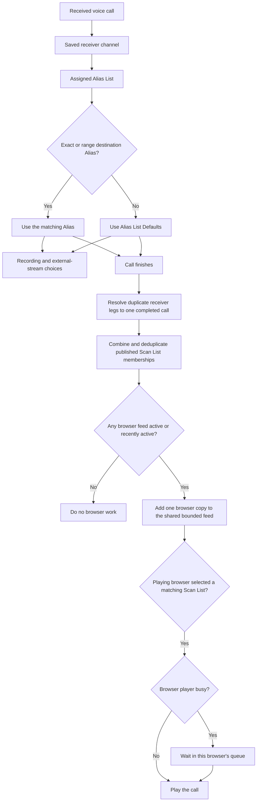

# How Browser Listening and Scan Lists Work

> **Release scope:** This guide describes current `main` and Nightly behavior. Numbered Alpha builds may omit these
> newer browser-listening and Alias features.

`sdrtrunk-vce` receives and decodes calls continuously. Browser listening begins with a completed call: after the
receiver finishes a call, the call is matched to published Scan Lists and offered to browser listeners who selected
one of those lists.

This differs from upstream SDRTrunk, which sends live audio segments to its desktop playback outputs while each call
is still being produced.

## The Short Version

1. Each saved channel can be assigned one compatible Alias List.
2. A matching Alias, or the Alias List Defaults when no destination Alias matches, assigns the call to Scan Lists.
3. While at least one browser is playing or has just finished a feed request, the receiver places one browser copy of
   each eligible completed call in a shared bounded feed. Each playing browser fetches that announcement and either
   plays it or places it in that tab's local waiting queue.

## From a Call to the Browser

The diagram shows the normal destination-talkgroup path. Other matching Aliases, such as a source-radio Alias, can
add Scan List memberships. Recording and external streaming use their own outputs and do not pass through the browser
queue.

## What Decides Which Calls Play

### Channel and Alias List

Each saved channel can be assigned one Alias List. Traffic channels created from a trunked control channel inherit
that saved channel's assignment. `sdrtrunk-vce` keeps Alias Lists compatible with one
protocol family:

- P25
- DMR
- NXDN
- NBFM, which also covers conventional AM

A channel needs a compatible Alias List assignment for its Alias List Defaults to apply.

### Matching Alias or Alias List Defaults

When the destination talkgroup matches an exact or range Alias, that Alias supplies its Scan List memberships. Other
matched Aliases can add more memberships to the same call.

When no exact or range destination Alias matches, the assigned Alias List's Defaults supply the recording, external
streaming, and Scan List choices. An exact or range destination match suppresses this unmatched fallback, even when
the matching Alias belongs to no Scan List. A source-radio match alone does not suppress the fallback.

Changing Alias List Defaults does not rewrite existing Aliases. The defaults become the starting choices for new
talkgroup and talkgroup-range Aliases.

### Scan Lists

A Scan List is a reusable group of Alias routes. One Alias can belong to several Scan Lists, and one Scan List can
contain Aliases from different systems and Alias Lists, including Aliases used by conventional channels.

A browser listener can select up to 16 published Scan Lists. If a call matches several selected lists, the feed
returns that call once with all of its matching Scan List IDs. The browser also remembers recent call IDs so an
overlapping selection cannot enqueue the same call twice.

### What Hold and Avoid Control

The call display and the Hold/Avoid target are deliberately separate. A call can show a real digital group identity
while Hold or Avoid controls the stable channel or radio-system identity that produced it.

- Conventional AM and NBFM calls use the saved channel's `configuration_id`. The browser shows the channel label as
  the primary call identity instead of presenting the configured analog routing number as a talkgroup. Renaming the
  channel does not change the target.
- Conventional DMR calls use the saved channel plus timeslot, so traffic on slots 1 and 2 can be controlled
  separately. Other conventional digital calls use the saved channel, while their real talkgroup can still appear in
  the call details.
- Trunked calls use `radio_system_key` plus the talkgroup, patch group, or radio identity. The same talkgroup number on
  two radio systems therefore remains two separate Hold/Avoid targets. Native P25 systems use their WACN and System ID
  in the stable radio-system key, so saved channels that discover the same P25 system share Hold and Avoid state.
  Standard DMR Tier III uses its model (`tiny`, `small`, `large`, or `huge`) and Network ID, and NXDN Type-C uses its
  location category (`global`, `regional`, or `local`) and System ID. Saved channels share Hold and Avoid state only
  inside this receiver profile and only after the decoder has learned those complete identities. Capacity Plus,
  Connect Plus, Capacity Max, Hytera Tier III, unknown or incomplete DMR, incomplete NXDN Type-C, and NXDN Type-D
  remain separate for each saved channel.
- On trunked DMR, the timeslot says which radio resource carried the call. It does not split the radio system or the
  talkgroup Hold/Avoid target. Conventional DMR still uses the saved channel plus timeslot as described above.

The API returns this exact control target in `playback_target`. Its `label` is user-facing text; its `key` is the identity used
for selection. Channel names, Alias names, and RadioResolve IDs are never used as the key. For system-scoped targets, the
browser Avoid List also shows the system label and stable `radio_system_key`, so identical Alias text and numeric IDs on
different systems remain visibly distinguishable.

## The Default Setup

A fresh setup contains:

- one published Scan List named `Default`;
- `Default P25`, `Default DMR`, `Default NXDN`, and `Default Analog` (AM/NBFM) Alias Lists; and
- an unmatched-talkgroup route from each factory Alias List to `Default`.

Upgrading a database older than format 11 restores missing factory Alias Lists once, including previously deleted
defaults. An analog-family list named `Default NBFM` becomes `Default Analog` if the new name is available. Existing
custom lists and routing stay intact. A custom list occupying a factory name for another protocol is preserved under
a unique name, and only channels without a selected Alias List receive a compatible default.
Later startups do not recreate lists you delete after the upgrade.

New channels created in the Channel editor and new RadioReference trunked-site imports initially use the matching
factory Alias List. Another compatible Alias List can be selected instead. RadioReference agency-frequency imports
do not assign an Alias List automatically.

A newly created custom Alias List starts with no Scan List, recording, or external-streaming defaults. An
administrator can opt into those routes through Alias List Defaults. The four canonical factory Alias Lists retain
their unmatched-talkgroup route to `Default`, including when a canonical list is manually recreated.

With these factory settings, an Alias List does not need an entry for every talkgroup. Clear calls from unmatched
talkgroups are eligible for the `Default` Scan List through the Alias List Defaults.

New talkgroup and talkgroup-range Aliases normally inherit their Alias List Defaults. A newly imported RadioReference
talkgroup marked fully encrypted is instead created with browser playback, recording, and external streaming
disabled. Partial or unknown encryption status continues to inherit the normal defaults. This exception applies only
when a new Alias is imported; updating an existing RadioReference Alias preserves its Scan List, recording, and
streaming choices.

Selecting a published Scan List saves the selection in that user's preferences but does not start playback; press
**Play** when ready. If no available Scan List is selected when Play is pressed, the browser selects and saves the
published Scan List currently marked as default. At the API level, omitting `scan_list_id` selects that same default.

When importing legacy upstream SDRTrunk XML, listening-enabled Aliases are placed in the current default Scan List,
while Do Not Monitor Aliases remain outside it. Supported imported channels with no Alias List assignment receive the
compatible factory Alias List.

## What the Browser Queue Does

A browser starts at the feed's live edge. Calls already in the shared ring are not replayed or backfilled when Play is
pressed.

Each browser tab owns its own in-memory waiting queue:

- If the player is listening and idle, the next matching completed call becomes the current call immediately.
- If another call is playing or buffering, the new call waits.
- The call currently playing or buffering is separate from the waiting-call count.
- The limit is 100 waiting calls per browser.
- When a new call arrives at the limit, the oldest waiting call is removed and the new call is kept. This keeps the
  player closer to current activity.
- **Stop** ends feed requests, stops the current call, and clears the tab's waiting queue. Pressing Play again starts
  at the then-current live edge instead of replaying calls received while stopped.
- **Pause / Resume** in the full website's Scanner and playback bar freezes the current audio position without
  clearing the queue. Incoming calls continue queuing up to the same 100-call limit. Resume continues the current
  call and then the waiting calls; Stop still clears both, even while paused. Pause affects only this browser,
  not receiver decoding, recordings, external streams, or other listeners.
- While paused, the status shows the waiting-call count. The shared audio cache can still evict older calls, and
  queue overflow or unavailable audio produces the existing skipped-call notice. A long pause does not guarantee
  complete catch-up. Replay Last Call is disabled until Resume or Stop; Skip, Hold, Avoid, and Clear Queue remain
  available without resuming audio.
- Refreshing the page, opening a new browser document, or losing playback access also clears the tab's queue. A
  temporary connection interruption preserves calls already in the queue, although calls can be missed before the
  feed resumes. Hold, Avoid, Scan List changes, Skip, and Clear Queue can also remove or bypass waiting calls.
- **Replay Last Call** keeps exactly one decoded call in that tab and replays it locally. It does not ask the receiver
  to retain or retrieve browser listening history.

With **Conversation Mode** off, the browser plays the oldest known waiting call by call start time. With it on, calls
remain ordered by start time within each conversation, but the browser may keep playing the same conversation while
other calls are waiting. The per-user **Calls before switching** setting allows 1 through 20 calls and defaults to
four, after which another waiting conversation gets a turn. Both choices are in the Scanner page's playback-settings
panel. This regrouping applies only after calls have built up in the local queue; it cannot reorder audio that has
already started.

The browser queue stores call announcements and audio URLs rather than WAV audio. The browser fetches a call's audio
when that call reaches playback. While a browser feed remains active, the shared server ring holds at most 512 calls
or 128 MiB, and entries expire after 30 minutes. After the last feed request and a five-second handoff grace period,
the existing receiver-health maintenance pass releases the ring. These are safety bounds, not a replay-history
promise. A queued call can therefore become unavailable before the browser reaches it. If the audio is unavailable,
its fetch exceeds 15 seconds, or fetching or decoding fails, the player skips that call and continues.

The browser has no server-side listener queue or playback session. It makes one bounded call-feed request at a time;
one low-priority worker performs Scan List matching, metadata projection, and WAV encoding away from receiver
callbacks. A paused scanner that continues collecting calls keeps this shared worker and ring active, just as an
active listener does; pausing does not create a separate server-side audio archive. When no browser is requesting
calls, completed calls bypass that browser worker and ring entirely. Receiver decoding,
the bounded handoff, the shared ring, and the network are separately bounded, so the 100-call browser limit is not an
end-to-end delivery guarantee. When the feed detects a gap, the browser says that some calls could not be played and
continues with valid new calls. See [Web API v1](api-v1.md) for the technical limits.

## Example: A Cleveland Scan List

An administrator could create a Scan List named `Cleveland` and add:

- police and fire talkgroup Aliases from one P25 system;
- transit talkgroup Aliases from another trunked system; and
- dispatch Aliases used by conventional AM or NBFM channels.

A listener selects `Cleveland` to hear that combined group. The receiver configuration and the systems being decoded
do not change when the listener switches to another Scan List.

## Compared With Upstream SDRTrunk

`sdrtrunk-vce` is derived from [upstream SDRTrunk](https://github.com/DSheirer/sdrtrunk), maintained by Dennis Sheirer
and contributors. This comparison was checked against upstream `master` at
[`80360029`](https://github.com/DSheirer/sdrtrunk/commit/80360029efb008dca993938d1e34ad4a7a8c15bd)
on August 28, 2026.

| Behavior | Upstream SDRTrunk | `sdrtrunk-vce` |
| --- | --- | --- |
| Audio handoff | Sends an audio segment to desktop playback while the call is still being produced. | Sends a resolved, completed call to browser playback. |
| Overlapping calls | Assigns active segments to available audio output channels. A completed segment that remains unassigned is removed instead of building a growing completed-call backlog. | Lets eligible completed calls wait in each browser's bounded queue. |
| Listener selection | Uses a Listen switch and optional playback priority on each Alias. | Uses reusable Scan List memberships; each browser listener chooses one or more published lists. |
| No destination talkgroup Alias match | An unmatched destination does not change playback priority. If no other matching Alias changes it, the segment remains enabled at the default listening priority. | Uses the assigned Alias List Defaults for recording, external streaming, and Scan List routing. |
| Alias List protocol scope | One Alias List can index identifiers from multiple protocols. | Each Alias List belongs to the P25, DMR, NXDN, or NBFM protocol family. |
| Fresh defaults | Does not create Scan Lists; local audio remains enabled at the default playback priority unless a matching Alias changes it. | Creates `Default` plus four factory Alias Lists whose unmatched talkgroups route to it. |

Recording and external streaming remain separate actions in both projects. The completed-call queue described here is
specifically the `sdrtrunk-vce` browser-listening path.

## Related Documentation

- [Web API v1](api-v1.md)
- [Alias Discovery and Unmatched Talkgroup Storage](alias-discovery-storage.md)
- [How Talker Aliases Work](talker-alias-implementation.md)
