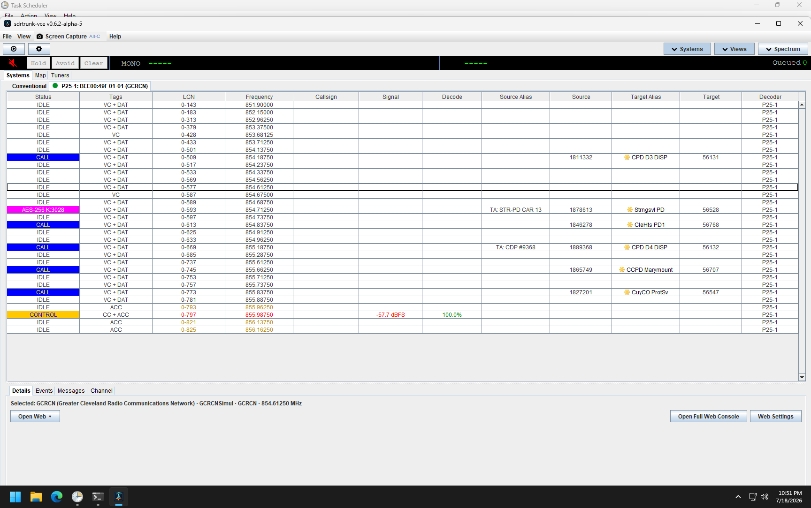
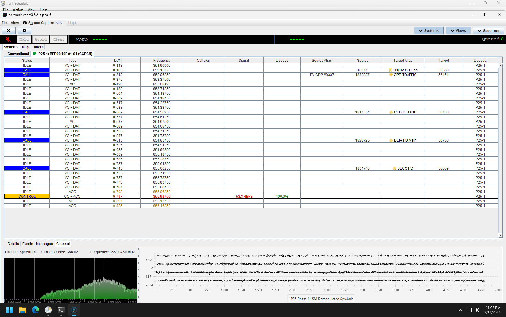
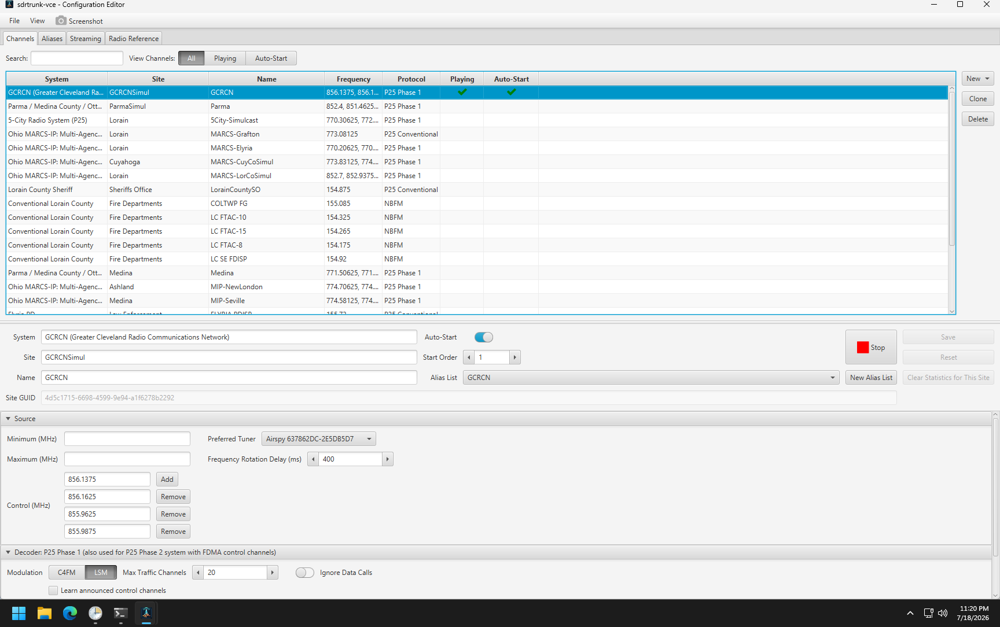
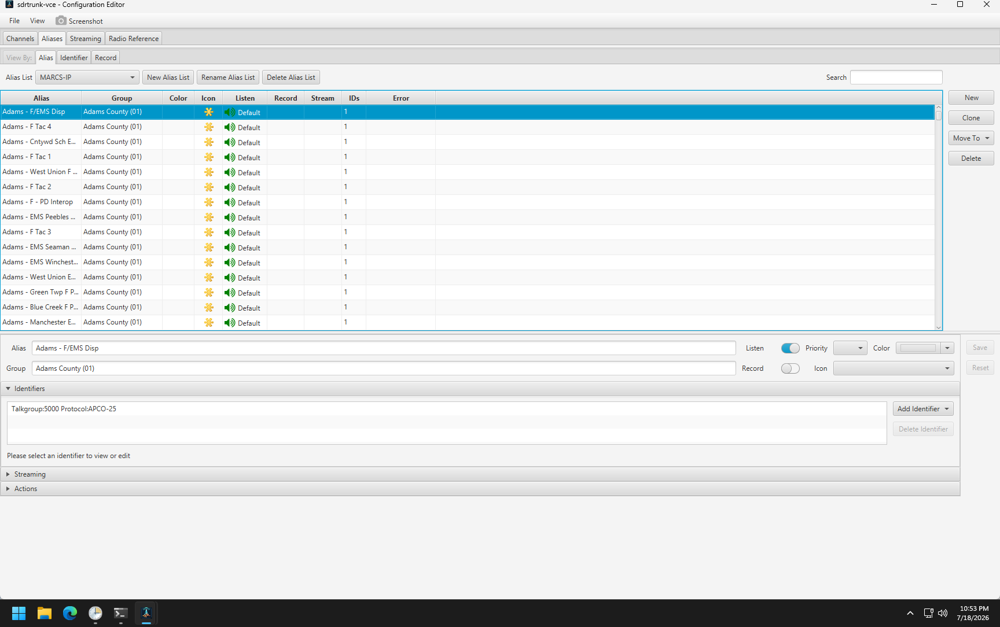

# Legacy radio UI reference

Status: internal design reference; not a visual acceptance baseline

This catalog records the current SDRTrunk Swing and radio-facing JavaFX interface before the radio UI is migrated to
the browser. It exists to preserve workflows, vocabulary, information relationships, status meaning, units, ranges,
warnings, and important states. It is deliberately **not** a request to clone the desktop UI in HTML.

The web design should use browser-native navigation, responsive layouts, progressive disclosure, virtualized tables,
drawers, and focused confirmation dialogs. Window chrome, pixel dimensions, fonts, colors, split-pane geometry, menu
placement, and desktop control density are reference evidence only.

The migration plan that governs this catalog is [the web-first UI migration master plan](../web-first-ui-migration-plan.md).
The plain-language [Settings migration review guide](settings-field-parity-ledger.md) and its
[filterable review page](settings-field-parity-ledger.html) track every Settings control and every planned removal
before detailed page mockups are approved. Source references remain available inside each row when needed.

## Capture provenance

| Item | Value |
| --- | --- |
| Node | BOSGAME, the non-production development receiver |
| Capture date | 2026-07-18 |
| Application | `sdrtrunk-vce v0.6.2-alpha-5` |
| Application JAR SHA-256 | `cd524254c3ca73ac29d68f0e8ac3ba6b7db7c93ee4756cbe4fe1d1d63aa076cf` |
| Desktop capture size | 1728 x 1084 |
| Curated images | 59 PNG files (6.5 MB); failed clicks, mislabeled frames, exact duplicates, and terminal-overlay recovery evidence excluded |
| Physical tuner evidence | Airspy R820T and RTL-2832/R828D |
| Capture policy | Read-only navigation of the existing BOSGAME profile; no Save, Reset, Delete, Clone, Start/Stop, Record, tuner mutation, import, calibration, test, or external submission actions |
| Secret policy | No production provider detail was selected; no password, API key, RadioReference credential, streaming endpoint, or encryption key is present in the curated set |

The screenshots contain internal operational reference data such as public-system names, talkgroup/radio IDs,
frequencies, tuner identifiers, and local BOSGAME paths. Re-review and sanitize them before publishing outside the
project. A thin Task Scheduler strip is visible behind many full-desktop Swing captures; it is not part of SDRTrunk.

## How to use this reference

For each web mockup, identify the legacy evidence being handled and mark each behavior as one of:

- **Preserve**: terminology, data, units, state, validation, safety warning, or workflow dependency remains.
- **Adapt**: the behavior remains but its presentation becomes web-native.
- **Combine**: related desktop surfaces become one coherent web route or workspace.
- **Retire**: desktop-only behavior has an explicit replacement or no longer has product value.

Do not use image diffs against these screenshots as a web acceptance test. Functional parity tests should assert
meaning, state transitions, validation, authorization, and safe runtime behavior.

### Desktop-to-web layout direction

| Desktop evidence | Web-first interpretation |
| --- | --- |
| Menu bar and toolbar buttons | Stable application navigation, command palette where useful, and permission-aware actions |
| Systems/site tabs plus lower Details, Events, Messages, Channel tabs | Persistent system/site context with linked Live, Details, Events, Messages, and Signal routes or panels |
| Dense live tables | Virtualized, filterable tables with browser-local column presets and a detail drawer |
| Configuration Editor top tabs | Playlist Settings navigation for Hardware, Channels, Aliases, Listen lists, Streaming, and RadioReference |
| Long accordion editors | Validated sections with progressive disclosure, dirty-state protection, impact previews, and explicit Save/Cancel |
| Dense labels, acronyms, and unfamiliar radio settings | A consistent circled-information button beside every Settings field/group; hover/focus previews help and click/tap keeps it open, while essential warnings and validation remain visible |
| Separate spectrum windows | An exclusive admin signal workspace with one selected tuner, bounded adaptive viewport refinement, responsive panels, and explicit busy/degraded/dropped-frame state |
| Tuner-family Swing forms | Capability-driven web forms with units, ranges, restart impact, lock state, and confirmation for disruptive commands |
| Desktop file pickers and arbitrary paths | Managed uploads or allowlisted logical storage choices; never arbitrary remote host browsing |
| Blocking modal workflows | Short confirmations or dedicated routes backed by cancellable jobs; never block decoder, tuner, recorder, or audio threads |

Blank fields in a static mockup are not proposed defaults. Every production editor must load SDRTrunk's current saved
value when it opens. If a value has never been saved, it must use the application's real built-in default rather than a
browser guess or a value copied from the wireframe.

## Representative views

### Live system activity

### Selected-channel signal and symbols

### Playlist/channel configuration

### Alias configuration

## Curated screenshot catalog

### Main Swing application

Primary source areas: `gui/SDRTrunk`, `controller/ControllerPanel`, `channel/metadata`, `module/decode/event`,
`gui/channel`, `spectrum`, `map`, `source/tuner/ui`, and `audio/playback`.

| ID | Evidence | What the web design should learn |
| --- | --- | --- |
| MAIN-01 | [File menu](images/bosgame-2026-07-18/main/menu-file.png), [View menu](images/bosgame-2026-07-18/main/menu-view.png), [Help menu](images/bosgame-2026-07-18/main/menu-help.png) | Reachable product areas and desktop-only commands; reorganize into route navigation, account/help areas, and local-only controls |
| MAIN-02 | [Systems activity](images/bosgame-2026-07-18/main/systems-activity.png) | Site context, call/control/encryption status, aliases, IDs, frequencies, decode quality, and selected-channel relationship |
| MAIN-03 | [Details](images/bosgame-2026-07-18/main/details.png) | Selected system/site/channel context and links into existing web detail pages |
| MAIN-04 | [Events](images/bosgame-2026-07-18/main/events.png), [event filters](images/bosgame-2026-07-18/main/events-filter.png) | Bounded live history, taxonomy filters, pause/reconnect/gap state, and selected-source scoping |
| MAIN-05 | [Messages](images/bosgame-2026-07-18/main/messages.png), [message filters](images/bosgame-2026-07-18/main/messages-filter.png) | Protocol message density, timestamps, filtering, and detail inspection without persistent raw-message storage |
| MAIN-06 | [Channel spectrum and symbols](images/bosgame-2026-07-18/main/channel-spectrum-symbols.png) | Spectrum, carrier offset, frequency, demodulated symbols, decoder type, and selected processing-chain context |
| MAIN-07 | [Map](images/bosgame-2026-07-18/main/map.png) | Track list, map, selected history, follow/replot semantics, history limit, and destructive clear/delete actions |
| MAIN-08 | [Tuner inventory](images/bosgame-2026-07-18/main/tuners-inventory.png) | Device status, class/type, frequency, channel count, selection, and empty-detail state |
| MAIN-09 | [Airspy controls](images/bosgame-2026-07-18/main/tuner-airspy.png), [Airspy info](images/bosgame-2026-07-18/main/tuner-airspy-info.png) | Device-specific capabilities, lock state, ranges, sample rate, gain, PPM, record/spectrum actions, and immutable hardware information |
| MAIN-10 | [RTL-SDR controls](images/bosgame-2026-07-18/main/tuner-rtl-sdr.png), [RTL-SDR info](images/bosgame-2026-07-18/main/tuner-rtl-sdr-info.png) | A second real capability set; the web form must be descriptor-driven rather than hard-coded to one tuner |
| MAIN-11 | [Add recording tuner](images/bosgame-2026-07-18/main/add-recording-tuner.png) | Managed recording-file selection and validation; replace remote arbitrary-path browsing |
| MAIN-12 | [Airspy spectrum/waterfall](images/bosgame-2026-07-18/main/spectrum-waterfall-airspy.png), [RTL-SDR spectrum/waterfall](images/bosgame-2026-07-18/main/spectrum-waterfall-rtl-sdr.png) | Shared frequency scale, FFT, waterfall, channel overlays, tuner context, and bounded/adaptive rendering |

The playback strip is visible in the main captures in its idle state. Active-call queue, Hold, Avoid, Clear, mute, and
playback-device variants were not manufactured during capture and remain in the coverage ledger below.

### JavaFX Configuration Editor

Primary source areas: `gui/configuration/channel`, `gui/configuration/source`, `gui/configuration/alias`,
`gui/configuration/streaming`, and `gui/configuration/radioreference`.

| ID | Evidence | What the web design should learn |
| --- | --- | --- |
| CFG-01 | [Editor shell](images/bosgame-2026-07-18/configuration/editor-shell.png), [File menu](images/bosgame-2026-07-18/configuration/menu-file.png), [View menu](images/bosgame-2026-07-18/configuration/menu-view.png) | Playlist/Aliases/Streaming/RadioReference ownership, import/export concepts, and full-screen configuration context |
| CFG-02 | [Selected channel](images/bosgame-2026-07-18/configuration/channels-selected.png), [new decoder menu](images/bosgame-2026-07-18/configuration/channel-new-decoder-menu.png) | Search/filter/list/detail workflow and supported decoder taxonomy |
| CFG-03 | [P25 source and decoder](images/bosgame-2026-07-18/configuration/channel-p25-source-decoder.png), [logging and recording](images/bosgame-2026-07-18/configuration/channel-p25-logging-recording.png) | Shared source/editor sections, protocol-specific settings, logging/recording choices, and save/reset semantics |
| CFG-04 | [Alias list](images/bosgame-2026-07-18/configuration/aliases-list.png), [selected alias](images/bosgame-2026-07-18/configuration/alias-selected.png) | Alias-list context, search, entity properties, identifiers, streaming assignments, retained stream-as-talkgroup behavior, and batch/destructive controls |
| CFG-05 | [Aliases by identifier](images/bosgame-2026-07-18/configuration/aliases-by-identifier.png), [aliases by recording](images/bosgame-2026-07-18/configuration/aliases-by-recording.png) | Alternative task-oriented projections should become views/filters, not duplicate editable state |
| CFG-06 | [Identifier type menu](images/bosgame-2026-07-18/configuration/alias-identifier-menu.png) | Identifier taxonomy and protocol-specific form selection |
| CFG-07 | [Streaming/actions sections](images/bosgame-2026-07-18/configuration/alias-streaming-actions.png), [expanded actions](images/bosgame-2026-07-18/configuration/alias-actions-expanded.png) | Preserve streaming assignment and stream-as-talkgroup behavior; Beep, Audio Clip, and Script actions are retirement evidence only |
| CFG-08 | [Empty Streaming view](images/bosgame-2026-07-18/configuration/streaming-empty.png), [provider menu](images/bosgame-2026-07-18/configuration/streaming-provider-menu.png) | Provider taxonomy, list/detail structure, enable/status/error state, and alias assignment without exposing write-only secrets |
| CFG-09 | [RadioReference logged-out view](images/bosgame-2026-07-18/configuration/radioreference-logged-out.png) | Authentication boundary and staged browse/preview/commit workflow; never return stored credentials to the browser |

### JavaFX User Preferences

Primary source area: `gui/preference`. These captures record the current field inventory. Final ownership is decided
field by field: radio settings move to authenticated web administration, browser-only presentation choices stay in the
browser, and server/listener/non-radio platform-service settings remain in the focused local JavaFX utility.

| ID | Evidence | Final direction |
| --- | --- | --- |
| PREF-01 | [Navigation shell](images/bosgame-2026-07-18/preferences/preferences-shell.png) | Inventory only; do not reproduce the JavaFX tree verbatim |
| PREF-02 | [Application](images/bosgame-2026-07-18/preferences/application.png) | Split radio auto-start behavior from genuinely local node startup settings |
| PREF-03 | [Audio call management](images/bosgame-2026-07-18/preferences/audio-call-management.png) | Web radio administration |
| PREF-04 | [MP3 encoding](images/bosgame-2026-07-18/preferences/audio-mp3.png) | Web radio administration |
| PREF-05 | [Playback and tones](images/bosgame-2026-07-18/preferences/audio-playback-tones.png) | Retire receiver-speaker output, local playback queue, and start/drop tones for the headless application; browser listeners own their output device |
| PREF-06 | [Recording format](images/bosgame-2026-07-18/preferences/audio-record.png) | Web radio administration |
| PREF-07 | [CPU vector calibration](images/bosgame-2026-07-18/preferences/cpu-vector-calibration.png) | Web diagnostics/radio workflow or automated headless calibration with explicit runtime impact |
| PREF-08 | [JMBE audio library](images/bosgame-2026-07-18/preferences/decoder-jmbe.png) | Managed web radio/module workflow or protected local bootstrap where host-file selection is unavoidable |
| PREF-09 | [Voice decryption module](images/bosgame-2026-07-18/preferences/decoder-voice-module.png) | Managed module workflow with secret-safe status |
| PREF-10 | [Channel event display](images/bosgame-2026-07-18/preferences/display-channel-events.png) | Browser-local presentation where possible |
| PREF-11 | [Systems display](images/bosgame-2026-07-18/preferences/display-systems.png) | Split runtime radio behavior from browser-local presentation |
| PREF-12 | [Talkgroup/radio ID display](images/bosgame-2026-07-18/preferences/display-identifiers.png) | Browser-local presentation unless a value changes exported/runtime semantics |
| PREF-13 | [Storage directories](images/bosgame-2026-07-18/preferences/storage-directories.png) | Local JavaFX/CLI owns managed roots; web chooses logical destinations only |
| PREF-14 | [Statistics/database](images/bosgame-2026-07-18/preferences/stats-server.png) | Web radio administration with forward-only bounded-retention rules for any newly proposed storage |
| PREF-15 | [Embedded web server](images/bosgame-2026-07-18/preferences/web-server.png) | Focused local JavaFX node administration; browser may show redacted status but cannot mutate it |
| PREF-16 | [Tuner/channelizer](images/bosgame-2026-07-18/preferences/source-tuners.png) | Move physical tuner settings to Hardware; move RSPduo mode to its physical device; retire the channelizer selector and heterodyne implementation |

### Other product windows

| ID | Evidence | Final direction |
| --- | --- | --- |
| OTHER-01 | [Icon Manager](images/bosgame-2026-07-18/other/icon-manager.png) | Retirement evidence only; legacy raster assets and the manager do not move, and Aliases use packaged vector icons |
| OTHER-02 | [Message Recording Viewer](images/bosgame-2026-07-18/other/message-recording-viewer.png) | Web diagnostic viewer or explicitly retired desktop-only tooling |
| OTHER-03 | [Locked encryption vault](images/bosgame-2026-07-18/other/encryption-keys-locked.png) | Authenticated secret-safe workflow; dummy-data capture required before designing unlocked states |
| OTHER-04 | [What's New](images/bosgame-2026-07-18/other/whats-new.png) | Web About/What's New route; may also remain informational in local node administration |
| OTHER-05 | [Bug report dialog](images/bosgame-2026-07-18/other/bug-report.png) | Web support workflow with explicit disclosure/redaction and no automatic external submission |
| OTHER-06 | [Credits](images/bosgame-2026-07-18/other/credits.png), [GNU GPL](images/bosgame-2026-07-18/other/gpl.png) | Web About/Licensing route; optional informational view in the retained local utility |

## Coverage ledger and deliberate gaps

`Captured` means the curated image is safe enough for internal design use. `Source-only` means the surface was found in
the code but was not exercised because doing so would mutate state, expose secrets, contact an external service, or
interrupt radio work. `Hardware unavailable` means BOSGAME cannot provide truthful physical evidence for that device.

| Surface or state | Status | Follow-up rule |
| --- | --- | --- |
| Main shell, menus, idle playback strip, Systems, Details, Events, Messages, filters, channel signal/symbols, Map | Captured | Use as behavioral evidence only |
| Active playback queue, Hold/Avoid/Clear/mute, playback-device menu, one/two-channel variants | Source-only | Capture only during naturally occurring sanitized playback or with deterministic local audio fixtures |
| BOSGAME Airspy and RTL-SDR tuner inventory, settings, info, and embedded spectrum/waterfall | Captured | Do not infer support for another tuner family from these images |
| Separate spectrum window and all spectrum context-menu branches | Source-only | Capture in a short isolated BOSGAME session using exact window handles; never rely on focus-dependent close shortcuts |
| Airspy HF+, HydraSDR, FCD, HackRF, SDRplay, other RTL variants, and recording-tuner editor | Hardware unavailable or source-only | Use a fake capability descriptor for mockups and require named physical evidence before retiring each supported family editor |
| Configuration shell, P25 Phase 1 editor, common source/decoder/logging/recording sections | Captured | Build protocol-neutral forms plus capability-specific sections |
| NBFM, DMR, NXDN, P25 Conventional/Phase 2, and unknown retained editors | Source-only | Render with an isolated synthetic BOSGAME data root; do not add channels to the working profile merely for screenshots |
| AM, LTR/LTR-Net, MPT-1327, Passport, and named Channel Map Editor | Retirement inventory | Use source/configuration fixtures to prove backed-up migration and removal; do not build web forms for them |
| Alias list, Alias/Identifier/Record projections, common editor, assignment panes, identifier menu | Captured | Variant editor data must use synthetic identities and local-only assets |
| Individual identifier editors and Beep/Clip action editors | Source-only | Use dummy values; legacy Script actions are retirement inventory only and must not be rendered or executed |
| Streaming empty/list state and provider menu | Captured | No production profile was selected or copied |
| Broadcastify, Icecast, OpenMHz, Rdio Scanner, RadioResolve, and Shoutcast provider detail forms | Source-only | Capture only from newly created dummy profiles in an isolated data root; never contact a real destination or expose a key/endpoint |
| RadioReference logged-out shell | Captured | No credentials were entered or shown |
| Logged-in country/state/county/system/site/talkgroup workflow | Source-only | Use a specifically approved sanitized account/session and do not commit imported configuration during capture |
| All current User Preferences pages | Captured | Selecting pages only; test, maintenance, calibration, and server controls were not exercised |
| Vault unlocked/add/edit/import/export | Source-only | Dummy keys in an isolated vault only |
| Loaded Message Recording Viewer detail states | Source-only | Use a small sanitized deterministic `.bits` fixture |
| Icon add/edit, JMBE updater, bug-report result/submission | Source-only | Use synthetic files/data; never submit externally for a screenshot |
| Coordinated startup What's New/calibration/vault/auto-start pages | Source-only | Timers and startup actions make these an isolated short-restart capture only |
| Native OS file choosers and intentionally induced error/failure dialogs | Excluded | Document validation/error contracts instead of staging unsafe failures |
| Developer-only channelizer/filter/squelch/sync/symbol test applications | Excluded | Test tooling, not supported product UI |

Missing screenshots are not parity. Before deleting a legacy surface, its row must either become a safe captured or
synthetic reference, or have an approved retirement decision with source-based behavior tests.

## Mockup gate

Before each user-facing runtime slice begins, create and approve its applicable annotated low-fidelity mockup. The
first approved slice may also authorize only the bounded cross-cutting foundation required to deliver it; unapproved
later slices remain blocked. The required mockups include at least:

1. [Public/anonymous listener](mockups/public-listener-v1.html), with completed-call browser audio, a required first-gesture
   start, current-call details, an automatic queue, Hold/Avoid/Clear/Skip controls, browser-local queue and display
   choices, independent audio/radio-page access states, reconnect/unavailable/queue-pressure states, and responsive
   controls. **The original design was approved 2026-07-21, but is now an archived baseline rather than the implementation
   target.** The [expanded Listen and Recordings draft](mockups/public-listener-recordings-v2.html) supersedes its FIFO-only
   player with a shared persistent player, administrator-made Listen lists, bounded recording search, Play now/queue/
   Play forward modes, Follow new calls, and no-database guest event playlists. The matching
   [Listen-list Settings editor](mockups/settings-shell-listen-lists-v1.html) is also a review draft. Neither new draft is
   implementation-approved yet.
2. [Administrator Dashboard and Live Systems](mockups/admin-dashboard-live-v1.html), including a signed-in current-state
   overview, public Dashboard fallback, actionable problem routing, bounded existing radio summaries, active-call
   snapshots, conventional/site group tabs with a narrow-screen site picker, the complete live channel field set,
   browser-local search/filter/sort, selected-channel context, independently gated route actions, and
   connecting/reconnect/missed-update/control-change/stopped/unavailable/busy/empty/access states.
   **Interactive review draft 2026-07-21; implementation has not been approved.**
3. [Wideband signal workspace](mockups/wideband-signal-page.md), including permanent admin-only access, one exclusive
   owner, adaptive zoom/drag-pan behavior, responsive/numeric fallback, and busy/degraded/reconnect states.
   **Implementation-approved 2026-07-19;** see
   the [short packaged BOSGAME canary](../testing/bosgame-webfirst-wideband-canary-2026-07-19.md).
4. [Selected-channel signal and symbol workspace](mockups/selected-channel-diagnostics-v1.html), including the stable
   Live selection, capability-specific Signal/Symbols/NBFM views, temporary RF-probe lease behavior, bounded telemetry,
   and ended/replacement/reconnect/degraded states.
   **Design approved 2026-07-21; implementation has not begun.**
5. [Events and Messages](mockups/events-messages-v1.html), including site-wide versus exact-chain scope, source-backed
   filters, fast-burst inspection, reconnect/replay/gap behavior, and bounded browser-only history.
   **Design approved 2026-07-21; implementation has not begun.**
6. [Tuner inventory and Hardware Settings](mockups/settings-shell-hardware-v1.html), including capability-driven Airspy
   and RTL-SDR forms, the source-added tuner-agnostic fixed-center choice, impact previews, confirmations,
   recording-tuner workflow, exclusive embedded spectrum, and empty/error/disconnected/unsupported states. The fixed-
   center control is source-backed because the BOSGAME reference screenshots predate it. **Design approved 2026-07-21;
   source-parity revision approved 2026-07-21; implementation has not begun.**
7. [Retained Channels](mockups/settings-shell-channels-v1.html), including search, Start/Stop-only multi-select,
   a ranked automatic-start queue, sortable headings, six retained decoder forms, DMR/NXDN maps, preservation states, and one-channel
   save/runtime/destructive workflows. **Design approved 2026-07-21; implementation has not begun.**
8. [Aliases](mockups/settings-shell-aliases-v1.html), including bounded large-list search and paging, Talkgroup/Radio/Other
   task views, explicit current-page bulk operations, integrated matching identifiers, explicit NXDN Talkgroup/Radio
   exact-and-range creation plus shared AMBE tones, vector appearance, streaming assignments, overlap and preservation
   states, and Alias List impact previews. **Design approved 2026-07-21; NXDN source-parity revision approved
   2026-07-21; implementation has not begun.**
   RadioReference preview/commit workflows remain separate mockup work.
   [Listen lists](mockups/settings-shell-listen-lists-v1.html) now form a separate Playlist Settings page after Aliases.
   They contain existing channels and talkgroups and are the authoritative live browser-audio filter. Membership can
   play a call even when Record is off or a legacy Alias is marked Do Not Monitor; only successfully saved calls whose
   destination talkgroup had Record enabled appear under Recordings. Recorded files use the fixed application-owned `calls/v1` hierarchy by date, system,
   site, channel, and talkgroup; there is no folder-template setting. The Listen-list design still requires its own
   implementation approval.
9. [Streaming providers](mockups/settings-shell-streaming-v1.html), including current-only status, provider-specific forms,
   write-only credentials, add/clone/delete and Broadcastify discovery workflows, explicit Alias impact, bounded connection
   testing, and imported-unknown compatibility handling. **Design approved 2026-07-21; implementation has not begun.**
10. [RadioReference importer](mockups/settings-shell-radioreference-v1.html), including write-only sign-in, one unified
   systems-and-agencies browse list, trunked sites/frequencies, conventional frequencies, talkgroups, deterministic temporary
   import previews, transactional commits, and loading/cancel/error/unsupported states. **Design approved 2026-07-21;
   implementation has not begun.**
11. [General Settings](mockups/settings-shell-general-v1.html), including Calls, Audio, Voice decoders and keys,
   Performance, Display and radio IDs, Storage, Statistics, Public access, focused secret/destructive dialogs,
   background-job states, current-value loading requirements, and source-backed field help. The earlier design was
   approved 2026-07-21; the new separate recorded-call retention control and split Live/Listen/Recordings access policies
   are **review-draft changes that need approval before implementation.**
12. The focused local JavaFX node-administration utility for listener/server, non-radio services, recovery, and the
   reserved future certificate workflow.

Each mockup must cite the catalog IDs it preserves, adapts, combines, or retires. Approval is feature-scoped: the
wideband approval closes item 3 and authorizes its bounded platform foundation, but it does not authorize implementation
of another listed surface. Every Settings mockup must show the universal information button and at least one open-help
state, including keyboard and touch behavior. The complete design gate remains open until every item is completed and
approved.
